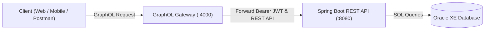

# Tài Liệu Đặc Tả & Hướng Dẫn Tích Hợp GraphQL Order API

> **Phiên bản:** `1.0.0`  
> **Ngày cập nhật:** 18/09/2026  
> **GraphQL Gateway Endpoint:** `POST http://localhost:4000/graphql`  
> **GraphiQL Playground:** `http://localhost:4000/`  
> **Backend REST Service:** `http://localhost:8080` (Spring Boot)

---

## 1. Kiến Trúc & Tổng Quan

Hệ thống phân chia ranh giới theo mô hình **API Gateway & Microservices / Modular Monolith**:
- **Backend Service ([`erp_springboot-experiment`](file:///home/ddicgegd/Projects/erp_springboot-experiment)):** Đóng vai trò là trung tâm nghiệp vụ cốt lõi (Core Business Domain), cung cấp RESTful API thuần túy, đảm nhiệm tương tác cơ sở dữ liệu Oracle Database, quản lý transactional data, bảo mật token Spring Security.
- **Gateway Service ([`graphQL-service`](file:///home/ddicgegd/Projects/graphQL-service)):** Đóng vai trò GraphQL Gateway (Node.js/Express, port `4000`), chịu trách nhiệm tập hợp schema (Schema Federation/Aggregation), giải quyết over-fetching / under-fetching cho client, forward context và chuyển đổi phân trang/bộ lọc sang REST API backend.



---

## 2. Xác Thực & Phân Quyền (Authentication & Authorization)

Toàn bộ các yêu cầu GraphQL liên quan đến nghiệp vụ Order (trừ introspection public) đều yêu cầu đính kèm JSON Web Token (JWT) trong header HTTP:

```http
Authorization: Bearer <JWT_ACCESS_TOKEN>
Content-Type: application/json
```

- **Quyền Quản Trị (`ADMIN` / `SUPER_ADMIN`):** Yêu cầu cho các query quản lý toàn diện như `searchOrders`, `pendingOrders`, `inProgressOrders`, `orderStatistics`.
- **Quyền Khách Hàng (`CUSTOMER` / `USER`):** Yêu cầu cho các thao tác cá nhân như `myOrdersList`, `myOrderDetail`, `createOrder`, `cancelOrder`.
- **Cơ chế xử lý lỗi xác thực:** Khi không có token hoặc token không hợp lệ/hết hạn, Gateway trả về response envelope với mã trạng thái `401 Unauthorized` hoặc `403 Forbidden` thay vì sập server.

---

## 3. Danh Mục Queries (Truy Vấn)

### 3.1. `searchOrders`: Tìm kiếm & Phân trang đơn hàng nâng cao (Admin/Staff)
Cho phép tìm kiếm đơn hàng theo đa điều kiện: từ khóa khách hàng, mã đơn, danh sách trạng thái đơn hàng (`orderStatuses`), khoảng ngày tạo và khoảng giá trị đơn hàng.

#### Cú pháp GraphQL:
```graphql
query SearchOrders($filter: OrderSearchInput) {
  searchOrders(filter: $filter) {
    status {
      code
      message
    }
    data {
      paging {
        pageNumber
        pageSize
        totalPages
        totalElements
      }
      contents {
        orderNumber
        currentStatus
        currentStatusDescription
        customerName
        customerEmail
        customerPhone
        shippingAddress
        totalAmount
        subtotal
        shippingFee
        orderItems {
          attributesSku
          productName
          quantity
          unitPrice
          salePrice
          subtotal
        }
      }
    }
  }
}
```

#### Tham số đầu vào (`filter: OrderSearchInput`):
| Trường | Kiểu dữ liệu | Bắt buộc | Mô tả |
|---|---|:---:|---|
| `keyword` | `String` | Không | Từ khóa tìm kiếm tự do (tên, email khách hàng, mã đơn) |
| `orderNumber` | `String` | Không | Mã định danh đơn hàng (VD: `ORD-20260805-0981`) |
| `orderStatuses` | `[OrderStatus]` | Không | Danh sách các trạng thái cần lọc (VD: `[WAITING_PAYMENT, PROCESSING]`) |
| `orderStatus` | `OrderStatus` | Không | Lọc chính xác một trạng thái duy nhất |
| `customerName` | `String` | Không | Tên người nhận hoặc người mua |
| `customerEmail` | `String` | Không | Email khách hàng |
| `customerPhone` | `String` | Không | Số điện thoại nhận hàng |
| `startDate` | `String` | Không | Ngày bắt đầu lọc (định dạng `YYYY-MM-DDTHH:mm:ss`) |
| `endDate` | `String` | Không | Ngày kết thúc lọc |
| `minAmount` | `Float` | Không | Giá trị đơn tối thiểu |
| `maxAmount` | `Float` | Không | Giá trị đơn tối đa |
| `page` | `Int` | Không | Trang cần lấy (Bắt đầu từ `1`, mặc định: `1`) |
| `size` | `Int` | Không | Số bản ghi mỗi trang (Mặc định: `20`) |
| `sortBy` | `String` | Không | Trường sắp xếp (Mặc định: `auditInfo.createdAt`) |
| `sortDirection` | `SortDirection` | Không | `ASC` hoặc `DESC` (Mặc định: `DESC`) |

---

### 3.2. `orderDetail`: Tra cứu chi tiết đơn hàng theo `orderNumber`
Cho phép tra cứu chi tiết đơn hàng đầy đủ theo mã đơn hàng. Tự động hỗ trợ cơ chế fallback tra cứu thông qua quyền Admin nếu đơn hàng không thuộc về phiên của user hiện tại.

#### Cú pháp GraphQL:
```graphql
query GetOrderDetail($orderNumber: String!) {
  orderDetail(orderNumber: $orderNumber) {
    status {
      code
      message
    }
    data {
      orderNumber
      currentStatus
      currentStatusDescription
      customerName
      customerPhone
      shippingAddress
      subtotal
      shippingFee
      totalAmount
      orderItems {
        attributesSku
        productName
        quantity
        unitPrice
        salePrice
        subtotal
        imageUrl
      }
    }
  }
}
```

---

### 3.3. `pendingOrders`: Danh sách đơn hàng chờ xử lý
Lấy danh sách các đơn hàng đang ở trạng thái chờ thanh toán (`WAITING_PAYMENT`) hoặc chờ xử lý duyệt.

#### Cú pháp GraphQL:
```graphql
query GetPendingOrders {
  pendingOrders {
    status {
      code
      message
    }
    data {
      orderNumber
      currentStatus
      currentStatusDescription
      customerName
      totalAmount
      createdAt
    }
  }
}
```

---

### 3.4. `inProgressOrders`: Danh sách đơn hàng đang vận chuyển/xử lý
Lấy danh sách các đơn hàng đã được duyệt và đang trong quá trình đóng gói, vận chuyển (`PROCESSING`, `SHIPPED`).

#### Cú pháp GraphQL:
```graphql
query GetInProgressOrders {
  inProgressOrders {
    status {
      code
      message
    }
    data {
      orderNumber
      currentStatus
      currentStatusDescription
      customerName
      customerPhone
      shippingAddress
      totalAmount
    }
  }
}
```

---

### 3.5. `orderStatistics`: Thống kê doanh thu & đơn hàng
Truy vấn dữ liệu thống kê doanh số bán hàng trong một khoảng thời gian. Nếu không chỉ định `startDate` và `endDate`, hệ thống tự động thiết lập phạm vi an toàn từ đầu năm đến ngày hiện tại.

#### Cú pháp GraphQL:
```graphql
query GetOrderStatistics($startDate: String, $endDate: String) {
  orderStatistics(startDate: $startDate, endDate: $endDate) {
    status {
      code
      message
    }
    data {
      startDate
      endDate
      totalRevenue
      totalOrders
      ordersByStatus {
        status
        count
        revenue
      }
    }
  }
}
```

---

### 3.6. `myOrdersList`: Lịch sử đơn hàng của tôi (Khách hàng)
Dành cho khách hàng cá nhân tra cứu các đơn hàng của chính mình theo từng tab trạng thái.

#### Cú pháp GraphQL:
```graphql
query GetMyOrdersList($status: OrderStatus!, $page: Int, $size: Int) {
  myOrdersList(status: $status, page: $page, size: $size) {
    status {
      code
      message
    }
    data {
      paging {
        pageNumber
        pageSize
        totalElements
        totalPages
      }
      contents {
        orderNumber
        currentStatus
        totalAmount
        itemCount
        createdAt
        firstItemPreview {
          productName
          imageUrl
          sku
        }
      }
    }
  }
}
```

---

### 3.7. `myOrderDetail`: Chi tiết đơn hàng của khách hàng
Truy vấn chi tiết đơn hàng của người dùng đang đăng nhập, kèm lịch sử cập nhật trạng thái đơn hàng (`statusHistory`).

#### Cú pháp GraphQL:
```graphql
query GetMyOrderDetail($orderNumber: String!) {
  myOrderDetail(orderNumber: $orderNumber) {
    status {
      code
      message
    }
    data {
      orderNumber
      currentStatus
      shippingMethod
      paymentMethod
      receiverName
      receiverPhone
      shippingAddress
      subtotal
      shippingFee
      totalAmount
      customerNotes
      statusHistory {
        status
        timestamp
      }
    }
  }
}
```

---

## 4. Danh Mục Mutations (Thay Đổi Dữ Liệu)

### 4.1. `createOrder`: Đặt hàng mới
Khởi tạo một đơn hàng mới vào cơ sở dữ liệu.

#### Cú pháp GraphQL:
```graphql
mutation CreateNewOrder($input: CreateOrderInput!) {
  createOrder(input: $input) {
    status {
      code
      message
    }
    data {
      orderNumber
      currentStatus
      shippingFee
      totalAmount
    }
  }
}
```

#### Cấu trúc Variables mẫu:
```json
{
  "input": {
    "addressSku": "ADDR-TESTUSER-1",
    "shippingMethod": "DELIVERY",
    "paymentMethod": "COD",
    "customerNotes": "Vui lòng gọi trước khi giao",
    "items": [
      {
        "attributesSku": "ATTR-TABS10U-GRAPH-5G-512",
        "quantity": 1
      }
    ]
  }
}
```

---

### 4.2. `cancelOrder`: Hủy đơn hàng
Hủy bỏ một đơn hàng đang ở trạng thái cho phép hủy (ví dụ: `WAITING_PAYMENT`, `PROCESSING`).

#### Cú pháp GraphQL:
```graphql
mutation CancelOrder($orderNumber: String!, $cancellationReason: String) {
  cancelOrder(orderNumber: $orderNumber, cancellationReason: $cancellationReason) {
    status {
      code
      message
    }
    data {
      orderNumber
      currentStatus
      currentStatusDescription
    }
  }
}
```

#### Cấu trúc Variables mẫu:
```json
{
  "orderNumber": "ORD-20260805-0981",
  "cancellationReason": "Tôi muốn đổi sang phương thức thanh toán khác"
}
```

---

## 5. Bảng Mã Enums Chuẩn Hóa

### `OrderStatus`
- `PENDING`: Đơn hàng mới khởi tạo
- `WAITING_PAYMENT`: Chờ thanh toán
- `CONFIRMED`: Đã xác nhận đơn
- `PROCESSING`: Đang chuẩn bị hàng / xử lý
- `SHIPPED`: Đang giao hàng
- `DELIVERED`: Giao thành công
- `CANCELLED`: Đã hủy đơn
- `RETURNED`: Trả hàng hoàn tiền

### `ShippingMethod`
- `DELIVERY`: Giao hàng tận nơi
- `PICKUP`: Nhận tại kho / cửa hàng

### `PaymentMethod`
- `COD`: Thanh toán khi nhận hàng
- `BANK_TRANSFER`: Chuyển khoản ngân hàng
- `VNPAY`: Cổng VNPAY
- `MOMO`: Ví MoMo
- `CREDIT_CARD`: Thẻ quốc tế Visa/Mastercard
- `ZALOPAY`: Ví ZaloPay
- `PAYPAL`: Cổng PayPal

---

## 6. Mã Nguồn Mẫu Tích Hợp (Code Examples)

### 6.1. cURL (Bash CLI)
```bash
curl -X POST http://localhost:4000/graphql \
  -H "Authorization: Bearer <YOUR_ACCESS_TOKEN>" \
  -H "Content-Type: application/json" \
  -d '{
    "query": "query { searchOrders(filter: { page: 1, size: 5, orderStatuses: [WAITING_PAYMENT] }) { status { code message } data { contents { orderNumber currentStatus totalAmount customerName } } } }"
  }'
```

### 6.2. JavaScript (Fetch API / Node.js / Browser)
```javascript
async function fetchOrders(token) {
  const query = `
    query SearchOrders($filter: OrderSearchInput) {
      searchOrders(filter: $filter) {
        status { code message }
        data {
          paging { pageNumber pageSize totalElements }
          contents {
            orderNumber
            currentStatus
            totalAmount
          }
        }
      }
    }
  `;

  const response = await fetch('http://localhost:4000/graphql', {
    method: 'POST',
    headers: {
      'Authorization': `Bearer ${token}`,
      'Content-Type': 'application/json',
    },
    body: JSON.stringify({
      query,
      variables: {
        filter: {
          page: 1,
          size: 10,
          orderStatuses: ['WAITING_PAYMENT', 'PROCESSING']
        }
      }
    })
  });

  const result = await response.json();
  console.log('Orders data:', result.data.searchOrders);
}
```

### 6.3. Python (`requests`)
```python
import requests

GRAPHQL_URL = "http://localhost:4000/graphql"
TOKEN = "YOUR_ACCESS_TOKEN"

query = """
query GetOrderDetail($orderNumber: String!) {
  orderDetail(orderNumber: $orderNumber) {
    status { code message }
    data {
      orderNumber
      currentStatus
      totalAmount
      customerName
      orderItems {
        attributesSku
        quantity
        unitPrice
      }
    }
  }
}
"""

variables = {"orderNumber": "ORD-20260805-0981"}

response = requests.post(
    GRAPHQL_URL,
    headers={"Authorization": f"Bearer {TOKEN}"},
    json={"query": query, "variables": variables}
)

print(response.json())
```

---

## 7. Xử Lý Lỗi & Khắc Phục (Troubleshooting)

| Mã Lỗi (Code) | Ý nghĩa | Nguyên nhân thường gặp | Hướng dẫn khắc phục |
|:---:|---|---|---|
| `401` | `Unauthorized` | Token chưa truyền hoặc hết hạn | Gọi `POST /api/auth/login` để lấy access token mới |
| `403` | `Forbidden` | Tài khoản không có role `ADMIN` hoặc truy cập đơn của người khác | Kiểm tra quyền hạn của user trong bảng `user_roles` |
| `400` | `Validation Failed` | Thiếu `addressSku`, SKU sản phẩm không tồn tại hoặc hết hàng | Đảm bảo truyền đủ các trường bắt buộc trong `CreateOrderInput` |
| `404` | `Not Found` | Không tìm thấy mã đơn `orderNumber` | Kiểm tra lại tính chính xác của mã đơn hàng |
| `500` | `Internal Server Error` | Backend Spring Boot hoặc Oracle DB không thể kết nối | Kiểm tra trạng thái cổng `8080` và container `oracle-db` |
