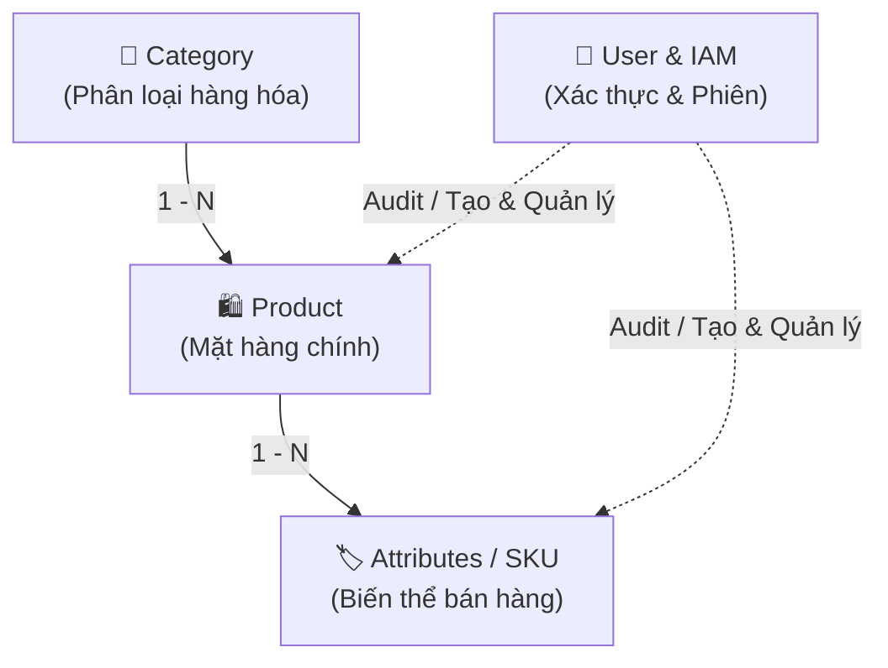

# 🏢 ERP System Features Hub (Map of Content)

> [!NOTE]
> Trang điều hướng trung tâm kết nối toàn bộ các phân hệ nghiệp vụ trong hệ thống ERP. Cung cấp cái nhìn tổng thể về phân cấp dữ liệu, mối quan hệ giữa các module và liên kết trực tiếp tới tài liệu đặc tả của từng tính năng.

---

## 🗺️ Bản Đồ Phân Hệ & Quan Hệ Nghiệp Vụ

---

## 📦 1. Phân Hệ Quản Lý Hàng Hóa (Merchandise)

Phân hệ Merchandise quản lý chuỗi cấu trúc dữ liệu 3 tầng: **Category (Danh mục) $\rightarrow$ Product (Sản phẩm) $\rightarrow$ Attributes (Biến thể SKU)**.

| Phân tầng | Tính năng | Mã SKU mẫu | Vai trò nghiệp vụ cốt lõi |
| :--- | :--- | :--- | :--- |
| **Cấp 1** | [[category/index\|📂 Quản Lý Danh Mục (Category)]] | `ctgr-8392` | Cây phân loại hàng hóa, cơ chế Cache đa tầng `categoryDetails`, xóa mềm 30 ngày. |
| **Cấp 2** | [[product/index\|🛍️ Quản Lý Sản Phẩm (Product)]] | `prd-9281-92` | Mặt hàng chính, lưu trữ ảnh MinIO/S3, đo lường chỉ số bán hàng (view, sold, revenue). |
| **Cấp 3** | [[attributes/index\|🏷️ Biến Thể & Thuộc Tính (Attributes)]] | `attr-92-4821` | Đơn vị lưu kho bán thực tế (SKU Item), 3 tầng giá, Color/Size, Smart Search Engine. |

---

## 🔐 2. Phân Hệ Định Danh & Người Dùng (IAM)

Phân hệ quản lý vòng đời tài khoản, bảo mật phiên làm việc và xác thực người dùng.

* 👤 **[[user/index\|Xác Thực & Quản Lý Người Dùng (User IAM)]]**
  * **Xác thực:** Đăng ký, kích hoạt email, đăng nhập thu thập `DeviceInfo`, xoay vòng Refresh Token.
  * **Hồ sơ:** Xem/sửa thông tin cá nhân, upload avatar multipart.
  * **Bảo mật & Phục hồi:** Khôi phục tài khoản qua email (Token Reuse 24h), đặt lại mật khẩu, đổi Username kèm Cooldown 30 ngày và thu hồi phiên toàn cục.

---

## 📊 3. Bảng Tổng Hợp Trạng Thái & Obsidian Bases

Hệ thống cung cấp các giao diện bảng / thẻ tự động để theo dõi tiến độ các tính năng:

* 📋 **[[user.base|User & IAM Feature Base]]** - Bộ lọc và bảng theo dõi các tài liệu thuộc module IAM.
* 📋 **[[merchandise.base|Merchandise Feature Base]]** - Bộ lọc và bảng theo dõi các tài liệu thuộc module Merchandise.

---

## 🔗 Liên Kết Nhanh Đến Các File Đặc Tả

* [[category/index|Tài liệu Category (Danh mục)]]
* [[product/index|Tài liệu Product (Sản phẩm)]]
* [[attributes/index|Tài liệu Attributes (Biến thể SKU)]]
* [[user/index|Tài liệu User (Người dùng & IAM)]]
