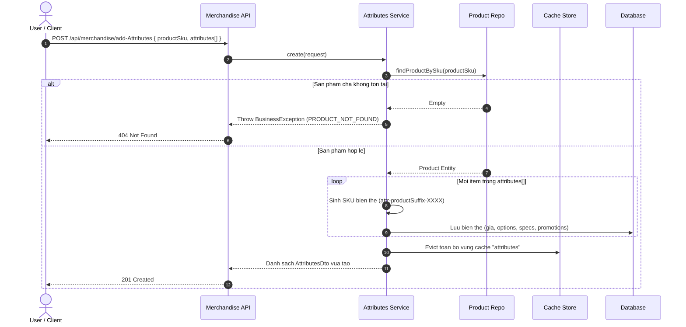
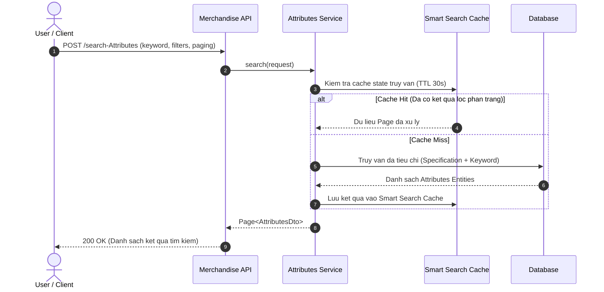

# Merchandise Attributes & Variant Management

> [!NOTE]
> Module **Biến thể & Thuộc tính (Attributes)** quản lý các đơn vị lưu kho thực tế (Stock Keeping Unit - SKU Level) trực thuộc một sản phẩm cha. Hệ thống hỗ trợ đa tùy chọn biến thể (màu sắc, kích thước), cơ chế 3 tầng giá linh hoạt (giá niêm yết, giá khuyến mãi, giá vốn), thông số kỹ thuật chi tiết, chính sách khuyến mãi và công cụ tìm kiếm thông minh tối ưu bằng Cache đa tầng.

---

## 1. Khái Niệm Cốt Lõi & Mô Hình Dữ Liệu (Core Concepts & Data Models)

### 1.1. Thông Tin Biến Thể (Attributes Data Model)
Mô hình dữ liệu đại diện cho một biến thể sản phẩm có thể giao dịch:

| Tên trường | Kiểu dữ liệu | Ràng buộc | Mô tả |
| :--- | :--- | :--- | :--- |
| `id` | `Long` | Định danh | ID số tự tăng nội bộ của biến thể |
| `name` | `String` | Bắt buộc | Tên phân loại biến thể |
| `sku` | `SkuInfo` | Bắt buộc | Cấu trúc mã SKU định danh duy nhất của biến thể |
| `price` | `Double` | Bắt buộc | Giá niêm yết gốc của biến thể |
| `salePrice` | `Double` | Bắt buộc | Giá bán khuyến mãi thực tế áp dụng cho khách hàng |
| `costPrice` | `Double` | Tùy chọn | Giá vốn nhập hàng (phục vụ tính toán lợi nhuận) |
| `variantOptions` | `List<VariantOption>` | Tùy chọn | Danh sách các tùy chọn thuộc tính (Màu sắc, Size, v.v.) |
| `statusProduct` | `StockStatus` | Bắt buộc | Trạng thái tồn kho (`AVAILABLE`, `OUT_OF_STOCK`, `DISCONTINUED`) |
| `specifications` | `List<SpecificationGroup>` | Tùy chọn | Danh sách nhóm thông số kỹ thuật chi tiết |
| `promotions` | `List<Promotion>` | Tùy chọn | Các chương trình khuyến mãi và điều kiện quà tặng kèm theo |
| `keywords` | `Set<String>` | Tùy chọn | Tập hợp từ khóa tìm kiếm nhanh |
| `product` | `ProductDto` | Liên kết | Thông tin sản phẩm cha sở hữu biến thể này |

**Cấu trúc dữ liệu mẫu (`AttributesDto`):**
```json
{
  "id": 501,
  "name": "Áo Thun Nam Cotton - Xanh Navy / Size L",
  "sku": {
    "sku": "attr-92-4821",
    "barcode": null
  },
  "price": 250000.0,
  "salePrice": 199000.0,
  "statusProduct": "AVAILABLE",
  "variantOptions": [
    {
      "name": "Color",
      "value": "Xanh Navy"
    },
    {
      "name": "Size",
      "value": "L"
    }
  ],
  "specifications": [
    {
      "groupName": "Chất liệu & Xuất xứ",
      "items": [
        {
          "name": "Chất liệu",
          "value": "100% Cotton Compact"
        },
        {
          "name": "Xuất xứ",
          "value": "Việt Nam"
        }
      ]
    }
  ],
  "promotions": [
    {
      "code": "SUMMER_SALE",
      "description": "Giảm 20% đón hè",
      "discountAmount": 51000.0
    }
  ],
  "keywords": ["ao thun", "cotton", "xanh navy", "size L"]
}
```

### 1.2. Định Danh Mã SKU Biến Thể (Variant SKU Generation)
* Khi tạo mới biến thể cho một sản phẩm, hệ thống tự động sinh mã SKU theo cấu trúc: `attr-<productSkuSuffix>-<random4digits>`.
* Ví dụ: Sản phẩm có SKU `prd-9281-92` sẽ sinh ra các SKU biến thể như `attr-92-4821`, `attr-92-7104`.
* Mã SKU biến thể là định danh duy nhất trong toàn bộ giỏ hàng, đơn hàng và kho bãi.

### 1.3. Cấu Trúc 3 Tầng Giá (Pricing Architecture)
1. **Giá Niêm Yết (`price`):** Giá bán chuẩn của sản phẩm khi chưa áp dụng ưu đãi.
2. **Giá Bán Thực Tế (`salePrice`):** Giá khách hàng phải thanh toán sau khi trừ khuyến mãi.
3. **Giá Vốn (`costPrice`):** Chi phí nhập hoặc sản xuất, dùng cho mục đích kế toán và báo cáo biên lợi nhuận.

### 1.4. Cơ Chế Tìm Kiếm Thông Minh & Cache (Smart Search Engine)
* **Local RAM Cache:** Tích hợp bộ nhớ đệm Caffeine (`SMART_SEARCH_CACHE`) với thời gian tồn tại ngắn (30 giây) để lưu tạm trạng thái truy vấn phân trang và tìm kiếm mờ theo từ khóa.
* **Cache Eviction:** Khi có bất kỳ thao tác thêm mới hoặc sửa đổi biến thể, vùng nhớ đệm `attributes` sẽ được vô hiệu hóa để đảm bảo độ chính xác của số liệu.

---

## 2. Đặc Tả Chi Tiết Từng Chức Năng (API Specifications)

---

### 2.1. Thêm mới danh sách biến thể theo lô (Add Attributes Batch)
Tạo đồng thời nhiều biến thể cho một sản phẩm cha dựa trên mã SKU sản phẩm.

* **Method & Path:** `POST /api/merchandise/add-Attributes`
* **Xác thực:** `Bearer JWT`
* **Request Payload:**
```json
{
  "name": "Áo Thun Nam Cotton",
  "productSku": "prd-9281-92",
  "keywords": ["ao thun", "nam", "cotton"],
  "attributes": [
    {
      "name": "Áo Thun Nam - Xanh Navy / Size L",
      "price": 250000.0,
      "salePrice": 199000.0,
      "statusProduct": "AVAILABLE",
      "variantOptions": [
        { "name": "Color", "value": "Xanh Navy" },
        { "name": "Size", "value": "L" }
      ],
      "specifications": [],
      "promotions": []
    },
    {
      "name": "Áo Thun Nam - Đen / Size XL",
      "price": 250000.0,
      "salePrice": 199000.0,
      "statusProduct": "AVAILABLE",
      "variantOptions": [
        { "name": "Color", "value": "Đen" },
        { "name": "Size", "value": "XL" }
      ],
      "specifications": [],
      "promotions": []
    }
  ]
}
```
* **Response Payload (`201 Created`):** Trả về danh sách `AttributesDto` vừa tạo thành công kèm mã SKU tự sinh.

---

### 2.2. Cập nhật thông tin biến thể (Update Attributes)
Chỉnh sửa giá bán, trạng thái tồn kho, tùy chọn biến thể, thông số kỹ thuật và khuyến mãi của một biến thể.

* **Method & Path:** `PUT /api/merchandise/update-Attributes`
* **Xác thực:** `Bearer JWT`
* **Request Payload:**
```json
{
  "id": "501",
  "name": "Áo Thun Nam Cotton - Xanh Navy / Size L (Mới)",
  "price": 260000.0,
  "salePrice": 210000.0,
  "status": "AVAILABLE",
  "variantOptions": [
    { "name": "Color", "value": "Xanh Navy" },
    { "name": "Size", "value": "L" }
  ],
  "keywords": ["ao thun", "cotton", "xanh navy"]
}
```
* **Response Payload (`200 OK`):**
```json
{
  "status": {
    "code": 200,
    "message": "Success"
  },
  "data": "Cập nhật biến thể thành công."
}
```

---

### 2.3. Xóa danh sách biến thể theo ID (Delete Attributes)
Xóa danh sách biến thể dựa trên danh sách ID được cung cấp.

* **Method & Path:** `DELETE /api/merchandise/delete-Attributes`
* **Xác thực:** `Bearer JWT`
* **Query Parameters:**
  * `ids` (List of String, required): Danh sách ID của các biến thể cần xóa.
* **Response Payload (`204 No Content`):** Không có nội dung body.

---

### 2.4. Xóa toàn bộ biến thể theo sản phẩm (Delete Attributes by Product)
Xóa tất cả biến thể liên kết với một sản phẩm cụ thể.

* **Method & Path:** `DELETE /api/merchandise/delete-Attributes-by-Product/{productId}`
* **Xác thực:** `Bearer JWT`
* **Path Parameters:**
  * `productId` (String, required): ID của sản phẩm cha.
* **Response Payload (`204 No Content`):** Không có nội dung body.

---

### 2.5. Tìm kiếm & Lọc phân trang biến thể (Search Attributes)
Tìm kiếm nâng cao hỗ trợ từ khóa mờ, lọc theo khoảng giá gốc, khoảng giá khuyến mãi, khoảng giá vốn, số lượng bán, trạng thái, SKU và ngày tạo.

* **Method & Path:** `POST /api/merchandise/search-Attributes`
* **Xác thực:** `Public` / `Bearer JWT`
* **Request Payload:**
```json
{
  "keyword": "Xanh Navy",
  "productSku": "prd-9281-92",
  "statuses": ["AVAILABLE"],
  "minSalePrice": 100000.0,
  "maxSalePrice": 300000.0,
  "paging": {
    "page": 1,
    "size": 10
  }
}
```
* **Response Payload (`200 OK`):**
```json
{
  "status": {
    "code": 200,
    "message": "Success"
  },
  "data": {
    "contents": [
      {
        "id": 501,
        "name": "Áo Thun Nam Cotton - Xanh Navy / Size L",
        "sku": {
          "sku": "attr-92-4821"
        },
        "price": 250000.0,
        "salePrice": 199000.0,
        "statusProduct": "AVAILABLE"
      }
    ],
    "paging": {
      "pageNumber": 0,
      "pageSize": 10,
      "totalPage": 1,
      "totalRecord": 1
    }
  }
}
```

---

### 2.6. Lấy danh sách biến thể theo ID (Get Attributes by IDs)
Truy xuất nhanh danh sách biến thể qua danh sách ID.

* **Method & Path:** `GET /api/merchandise/attributes`
* **Xác thực:** `Public` / `Bearer JWT`
* **Query Parameters:**
  * `ids` (List of Long, required): Danh sách ID cần lấy.
* **Response Payload (`200 OK`):** Trả về danh sách đối tượng `AttributesDto`.

---

### 2.7. Lấy danh sách biến thể theo SKU (Get Attributes by SKUs)
Truy xuất danh sách biến thể qua danh sách mã SKU biến thể.

* **Method & Path:** `GET /api/merchandise/attributes/by-skus`
* **Xác thực:** `Public` / `Bearer JWT`
* **Query Parameters:**
  * `skus` (List of String, required): Danh sách mã SKU biến thể.
* **Response Payload (`200 OK`):** Trả về danh sách đối tượng `AttributesDto`.

---

### 2.8. Lấy danh sách biến thể theo SKU sản phẩm (Get Attributes by Product SKUs)
Lấy toàn bộ các biến thể thuộc về danh sách SKU của sản phẩm cha.

* **Method & Path:** `GET /api/merchandise/attributes/by-product-skus`
* **Xác thực:** `Public` / `Bearer JWT`
* **Query Parameters:**
  * `productSkus` (List of String, required): Danh sách mã SKU sản phẩm cha.
* **Response Payload (`200 OK`):** Trả về danh sách đối tượng `AttributesDto`.

---

## 3. Sơ Đồ Luồng Tuần Tự (Sequence Workflows)

### 3.1. Luồng Tạo Biến Thể Hàng Loạt & Sinh SKU Theo Sản Phẩm



---

### 3.2. Luồng Tìm Kiếm Biến Thể Thông Minh (Smart Search Engine)



---

## 4. Bảng Xử Lý Lỗi Hệ Thống (HTTP Error Matrix)

| Tình huống lỗi | Mã HTTP | Error Message | Hành vi hệ thống |
| :--- | :---: | :--- | :--- |
| Không tìm thấy sản phẩm cha theo mã SKU | `404` | `Sản phẩm không tồn tại.` | Từ chối tạo danh sách biến thể |
| Không tìm thấy biến thể theo ID khi cập nhật | `404` | `Biến thể không tồn tại.` | Ngắt thao tác cập nhật |
| Giá bán nhỏ hơn 0 hoặc sai định dạng số | `400` | `Validation failed: Price must be positive` | Báo lỗi dữ liệu đầu vào |
| Danh sách ID rỗng khi thực hiện xóa | `204` | *(No Content)* | Kết thúc thành công không tác động DB |
| Dữ liệu tùy chọn biến thể (VariantOption) rỗng | `400` | `Variant options cannot be null` | Báo lỗi cấu trúc biến thể |
