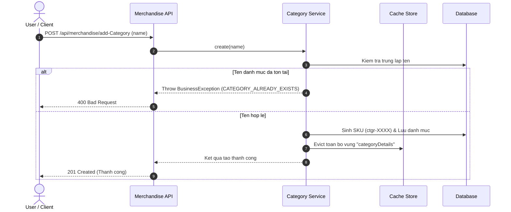
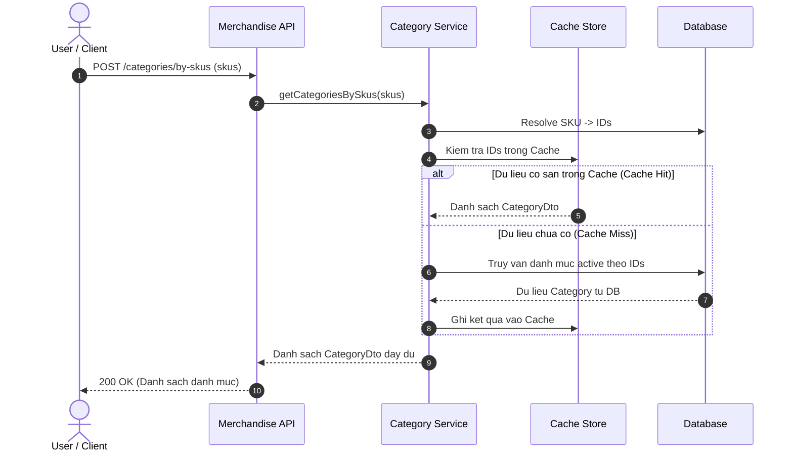

# Merchandise Category Management

> [!NOTE]
> Module **Quản lý Danh mục (Category)** chịu trách nhiệm phân loại hàng hóa và cấu trúc hóa danh mục sản phẩm trong hệ thống ERP. Hệ thống hỗ trợ định danh danh mục qua mã SKU tự sinh, tối ưu hóa truy xuất thông qua cơ chế Cache đa tầng (`categoryDetails`), quản lý xóa mềm an toàn và liên kết trực tiếp với dữ liệu sản phẩm.

---

## 1. Khái Niệm Cốt Lõi & Mô Hình Dữ Liệu (Core Concepts & Data Models)

### 1.1. Thông Tin Danh Mục (Category Data Model)
Mô hình dữ liệu đại diện cho một danh mục hàng hóa trong hệ thống:

| Tên trường | Kiểu dữ liệu | Ràng buộc | Mô tả |
| :--- | :--- | :--- | :--- |
| `id` | `Long` | Định danh | ID số tự tăng nội bộ của danh mục |
| `name` | `String` | Bắt buộc, Unique | Tên danh mục hàng hóa |
| `skuInfo` | `SkuInfo` | Bắt buộc | Cấu trúc định danh mã SKU danh mục |
| `productCount` | `Long` | Thống kê | Tổng số lượng sản phẩm đang trực thuộc danh mục |

**Cấu trúc dữ liệu mẫu (`CategoryDto`):**
```json
{
  "id": 101,
  "name": "Thời trang Nam",
  "skuInfo": {
    "sku": "ctgr-8392",
    "barcode": null
  },
  "productCount": 24
}
```

### 1.2. Định Danh Mã SKU Danh Mục (Category SKU Generation)
* Mỗi danh mục khi tạo mới được hệ thống tự động sinh một mã SKU duy nhất theo tiền tố `ctgr-` kết hợp hậu tố ngẫu nhiên (ví dụ: `ctgr-4921`).
* Mọi thao tác cập nhật, xóa mềm và truy xuất theo lô (Batch lookup) ưu tiên sử dụng mã SKU để giao tiếp thay vì phụ thuộc vào Database ID.

### 1.3. Cơ Chế Cache Đa Tầng (Multi-Level Caching)
* **Vùng Cache:** `categoryDetails`.
* **Cơ chế đọc:** Khi truy vấn danh mục theo ID hoặc SKU, hệ thống kiểm tra Cache trước. Nếu chưa có (Cache Miss), hệ thống nạp từ cơ sở dữ liệu và ghi vào Cache.
* **Cơ chế xóa Cache (Cache Eviction):** Khi thực hiện thêm mới, sửa tên hoặc xóa danh mục, toàn bộ dữ liệu trong vùng cache `categoryDetails` sẽ được làm mới tự động để tránh tình trạng hiển thị dữ liệu cũ.

### 1.4. Cơ Chế Xóa Mềm (Soft-Delete Policy)
* Thao tác xóa danh mục không xóa vật lý khỏi cơ sở dữ liệu mà ghi nhận thông tin người thực hiện xóa và thời điểm xóa.
* Dữ liệu xóa mềm sẽ bị ẩn khỏi các luồng tìm kiếm thông thường và tự động được dọn dẹp sau 30 ngày.

---

## 2. Đặc Tả Chi Tiết Từng Chức Năng (API Specifications)

---

### 2.1. Thêm mới danh mục (Add Category)
Tạo mới một danh mục sản phẩm trong hệ thống với tên duy nhất và sinh mã SKU tự động.

* **Method & Path:** `POST /api/merchandise/add-Category`
* **Xác thực:** `Bearer JWT` (hoặc quyền quản trị viên)
* **Request Payload:**
```json
{
  "name": "Thời trang Nam"
}
```
* **Response Payload (`201 Created`):**
```json
{
  "status": {
    "code": 200,
    "message": "Tạo danh mục thành công."
  },
  "data": "Tạo danh mục thành công."
}
```

---

### 2.2. Cập nhật danh mục (Update Category)
Cập nhật thông tin tên và mô tả của danh mục dựa trên mã SKU.

* **Method & Path:** `PUT /api/merchandise/update-Category`
* **Xác thực:** `Bearer JWT`
* **Request Payload:**
```json
{
  "sku": "ctgr-8392",
  "name": "Thời trang Nam Cao Cấp",
  "description": "Danh mục các sản phẩm thời trang nam chính hãng"
}
```
* **Response Payload (`200 OK`):**
```json
{
  "status": {
    "code": 200,
    "message": "Sửa danh mục thành công."
  },
  "data": "Sửa danh mục thành công."
}
```

---

### 2.3. Xóa mềm danh mục theo danh sách SKU (Delete Categories by SKUs)
Thực hiện đánh dấu xóa mềm đồng thời nhiều danh mục dựa trên danh sách mã SKU được cung cấp.

* **Method & Path:** `POST /api/merchandise/delete-Category`
* **Xác thực:** `Bearer JWT`
* **Request Payload:**
```json
{
  "skus": [
    "ctgr-8392",
    "ctgr-1042"
  ]
}
```
* **Response Payload (`204 No Content`):** Không có nội dung body.

---

### 2.4. Tìm kiếm & Phân trang danh mục (Search Categories)
Tìm kiếm danh mục theo từ khóa, lọc theo danh sách SKU, tên, người tạo hoặc khoảng thời gian tạo/cập nhật.

* **Method & Path:** `POST /api/merchandise/search-Category`
* **Xác thực:** `Public` / `Bearer JWT`
* **Request Payload:**
```json
{
  "keyword": "Thời trang",
  "skus": [],
  "names": [],
  "createdBy": null,
  "paging": {
    "page": 1,
    "size": 10
  }
}
```
* **Response Payload (`200 OK`):**
```json
{
  "status": {
    "code": 200,
    "message": "Success"
  },
  "data": {
    "contents": [
      {
        "id": 101,
        "name": "Thời trang Nam",
        "skuInfo": {
          "sku": "ctgr-8392"
        },
        "productCount": 24
      }
    ],
    "paging": {
      "pageNumber": 0,
      "pageSize": 10,
      "totalPage": 1,
      "totalRecord": 1
    }
  }
}
```

---

### 2.5. Lấy danh sách danh mục theo SKUs (Get Categories by SKUs)
Truy xuất nhanh danh sách chi tiết các danh mục dựa trên danh sách mã SKU.

* **Method & Path:** `POST /api/merchandise/categories/by-skus`
* **Xác thực:** `Public` / `Bearer JWT`
* **Request Payload:**
```json
{
  "skus": [
    "ctgr-8392",
    "ctgr-4412"
  ]
}
```
* **Response Payload (`200 OK`):**
```json
{
  "status": {
    "code": 200,
    "message": "Success"
  },
  "data": [
    {
      "id": 101,
      "name": "Thời trang Nam",
      "skuInfo": {
        "sku": "ctgr-8392"
      },
      "productCount": 24
    }
  ]
}
```

---

### 2.6. Kiểm tra tồn tại danh mục theo tên (Check Category Existence)
Kiểm tra xem tên danh mục đã tồn tại trong hệ thống hay chưa trước khi tạo mới.

* **Method & Path:** `POST /api/merchandise/checkCategory`
* **Xác thực:** `Public` / `Bearer JWT`
* **Request Payload:**
```json
{
  "name": "Thời trang Nam"
}
```
* **Response Payload (`200 OK`):**
```json
{
  "id": "101",
  "isExiting": true
}
```

---

### 2.7. Lấy danh sách sản phẩm theo SKUs danh mục (Get Products by Category SKUs)
Truy xuất toàn bộ danh sách sản phẩm thuộc về các danh mục được chỉ định.

* **Method & Path:** `POST /api/merchandise/products/by-category-skus`
* **Xác thực:** `Public` / `Bearer JWT`
* **Request Payload:**
```json
{
  "skus": [
    "ctgr-8392"
  ]
}
```
* **Response Payload (`200 OK`):** Trả về danh sách đối tượng `ProductDto` thuộc các danh mục tương ứng.

---

## 3. Sơ Đồ Luồng Tuần Tự (Sequence Workflows)

### 3.1. Luồng Tạo / Sửa Danh Mục & Vô Hiệu Hóa Cache



---

### 3.2. Luồng Tra Cứu Danh Mục Theo Lô (Batch SKU Lookup with Cache)



---

## 4. Bảng Xử Lý Lỗi Hệ Thống (HTTP Error Matrix)

| Tình huống lỗi | Mã HTTP | Error Message | Hành vi hệ thống |
| :--- | :---: | :--- | :--- |
| Tên danh mục đã tồn tại khi thêm mới | `400` | `Danh mục đã tồn tại.` | Từ chối tạo mới, yêu cầu chọn tên khác |
| Không tìm thấy danh mục theo mã SKU | `404` | `Danh mục không tồn tại.` | Ngắt thao tác cập nhật |
| Tên danh mục để trống khi tạo mới | `400` | `Tên danh mục không được để trống` | Báo lỗi validation dữ liệu đầu vào |
| Mã SKU để trống khi cập nhật | `400` | `Mã SKU không được để trống` | Báo lỗi validation dữ liệu đầu vào |
| Danh sách SKU rỗng khi thực hiện xóa | `204` | *(No Content)* | Kết thúc thành công không tác động DB |
