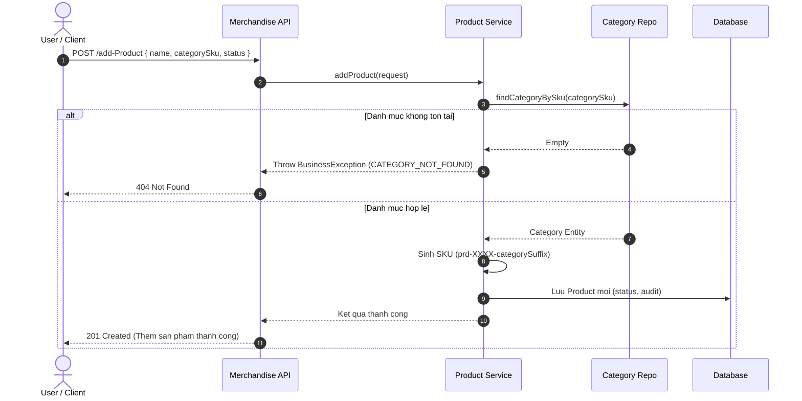
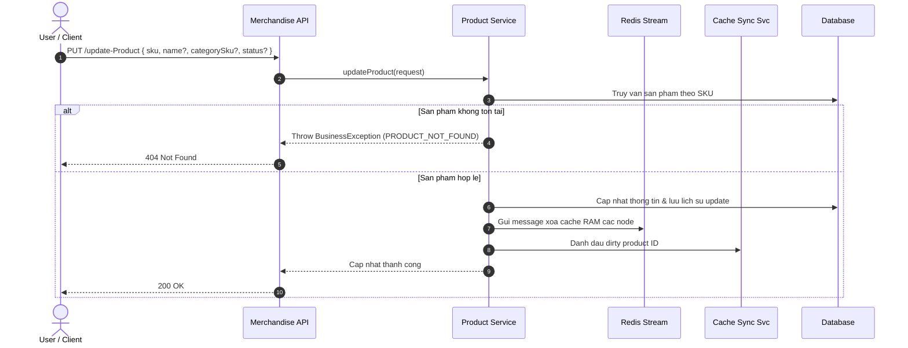

# Merchandise Product Management

> [!NOTE]
> Module **Quản lý Sản phẩm (Product)** là hạt nhân của hệ thống ERP bán hàng, chịu trách nhiệm quản lý thông tin hàng hóa, định danh SKU tự động theo danh mục, quản lý đa phương tiện hình ảnh (MinIO/S3), theo dõi chỉ số hiệu suất kinh doanh (lượt xem, doanh số, doanh thu) và tối ưu hóa hiệu năng tra cứu thông qua cơ chế Cache đa tầng (Caffeine RAM kết hợp Redis Stream).

---

## 1. Khái Niệm Cốt Lõi & Mô Hình Dữ Liệu (Core Concepts & Data Models)

### 1.1. Thông Tin Sản Phẩm (Product Data Model)
Mô hình dữ liệu đại diện cho một sản phẩm trong hệ thống:

| Tên trường | Kiểu dữ liệu | Ràng buộc | Mô tả |
| :--- | :--- | :--- | :--- |
| `id` | `Long` | Định danh | ID số tự tăng nội bộ của sản phẩm |
| `name` | `String` | Bắt buộc | Tên sản phẩm |
| `skuInfo` | `SkuInfo` | Bắt buộc | Cấu trúc mã SKU định danh sản phẩm |
| `categoryName` | `String` | Bắt buộc | Tên danh mục mà sản phẩm trực thuộc |
| `mediaItems` | `List<MediaItem>` | Tùy chọn | Danh sách hình ảnh và phương tiện của sản phẩm |
| `status` | `ActiveStatus` | Bắt buộc | Trạng thái hoạt động (`ACTIVE`, `LOCKED`) |
| `viewCount` | `Integer` | Thống kê | Tổng số lượt xem sản phẩm |
| `totalSoldQuantity` | `Integer` | Thống kê | Tổng số lượng sản phẩm đã bán ra |
| `totalRevenue` | `BigDecimal` | Thống kê | Tổng doanh thu tích lũy từ sản phẩm |

**Cấu trúc dữ liệu mẫu (`ProductDto`):**
```json
{
  "id": 201,
  "name": "Áo Thun Cotton Nam Classic",
  "skuInfo": {
    "sku": "prd-9281-92",
    "barcode": null
  },
  "categoryName": "Thời trang Nam",
  "mediaItems": [
    {
      "key": "prd-9281-92_img_0.jpg",
      "url": "https://storage.example.com/products/prd-9281-92_img_0.jpg"
    }
  ],
  "status": "ACTIVE",
  "viewCount": 1250,
  "totalSoldQuantity": 320,
  "totalRevenue": 48000000.00
}
```

### 1.2. Định Danh Mã SKU Sản Phẩm (Product SKU Generation)
* Khi tạo mới sản phẩm, hệ thống tự động sinh mã SKU theo cấu trúc: `prd-<random4digits>-<categorySkuSuffix>`.
* Ví dụ: Sản phẩm thuộc danh mục có mã SKU `ctgr-8392` sẽ được sinh mã SKU dạng `prd-9281-92`.
* Mã SKU đóng vai trò là khóa định danh nghiệp vụ duy nhất trên toàn bộ giao diện và API.

### 1.3. Quản Lý Phương Tiện & Hình Ảnh (Media Storage)
* Hình ảnh sản phẩm được lưu trữ trên hệ thống Object Storage (MinIO / S3).
* Hỗ trợ các nghiệp vụ: Tải lên thêm ảnh mới, thay thế toàn bộ danh sách ảnh, xóa ảnh đơn lẻ theo tên khóa (`key`) và stream trực tiếp dữ liệu ảnh qua API.

### 1.4. Chỉ Số Đo Lường & Hiệu Suất Kinh Doanh (Analytics & Metrics)
* Hệ thống tự động ghi nhận và cập nhật thời gian thực các chỉ số:
  * **Lượt xem (`viewCount`):** Tăng tự động khi người dùng mở trang chi tiết sản phẩm.
  * **Số lượng bán (`totalSoldQuantity`) & Doanh thu (`totalRevenue`):** Cập nhật khi đơn hàng thanh toán thành công.

### 1.5. Cơ Chế Cache Đa Tầng & Làm Mới Bất Đồng Bộ
* **Tầng 1 (Local RAM Cache - Caffeine):** Lưu trữ đối tượng `ProductDto` chi tiết trong vùng nhớ `productDetails` để phản hồi tức thì với độ trễ < 1ms.
* **Tầng 2 (Redis Stream & Dirty Sync):** Khi có thao tác cập nhật hoặc xóa sản phẩm, hệ thống gửi thông điệp xóa cache bất đồng bộ qua Redis Stream (`redisProducerService`) và đánh dấu dirty (`cacheSyncService`) để đồng bộ dữ liệu trên toàn cụm server.

---

## 2. Đặc Tả Chi Tiết Từng Chức Năng (API Specifications)

---

### 2.1. Thêm mới sản phẩm (Add Product)
Tạo mới sản phẩm, liên kết với danh mục thông qua SKU danh mục và tự động sinh mã SKU cho sản phẩm.

* **Method & Path:** `POST /api/merchandise/add-Product`
* **Xác thực:** `Bearer JWT`
* **Request Payload:**
```json
{
  "name": "Áo Thun Cotton Nam Classic",
  "categorySku": "ctgr-8392",
  "status": "ACTIVE"
}
```
* **Response Payload (`201 Created`):**
```json
{
  "status": {
    "code": 200,
    "message": "Thêm sản phẩm 'Áo Thun Cotton Nam Classic' thành công."
  },
  "data": "Thêm sản phẩm 'Áo Thun Cotton Nam Classic' thành công."
}
```

---

### 2.2. Cập nhật thông tin sản phẩm (Update Product)
Cập nhật tên, danh mục liên kết hoặc trạng thái hoạt động của sản phẩm dựa trên mã SKU.

* **Method & Path:** `PUT /api/merchandise/update-Product`
* **Xác thực:** `Bearer JWT`
* **Request Payload:**
```json
{
  "sku": "prd-9281-92",
  "name": "Áo Thun Cotton Nam Premium",
  "categorySku": "ctgr-8392",
  "status": "ACTIVE"
}
```
* **Response Payload (`200 OK`):**
```json
{
  "status": {
    "code": 200,
    "message": "Cập nhật sản phẩm thành công."
  },
  "data": "Cập nhật sản phẩm thành công."
}
```

---

### 2.3. Xóa mềm sản phẩm theo danh sách SKU (Delete Products by SKUs)
Đánh dấu xóa mềm danh sách sản phẩm và phát thông điệp xóa cache trên toàn hệ thống.

* **Method & Path:** `POST /api/merchandise/delete-Product`
* **Xác thực:** `Bearer JWT`
* **Request Payload:**
```json
{
  "skus": [
    "prd-9281-92",
    "prd-1042-92"
  ]
}
```
* **Response Payload (`204 No Content`):** Không có body.

---

### 2.4. Tìm kiếm & Lọc nâng cao sản phẩm (Search Products)
Hỗ trợ tìm kiếm theo từ khóa, lọc theo SKU sản phẩm, SKU danh mục, trạng thái, người tạo, khoảng giá, khoảng doanh thu, số lượng bán và khoảng thời gian.

* **Method & Path:** `POST /api/merchandise/search-Product`
* **Xác thực:** `Public` / `Bearer JWT`
* **Request Payload:**
```json
{
  "keyword": "Áo Thun",
  "categorySku": "ctgr-8392",
  "statuses": ["ACTIVE"],
  "minSoldQuantity": 10,
  "paging": {
    "page": 1,
    "size": 10
  }
}
```
* **Response Payload (`200 OK`):**
```json
{
  "status": {
    "code": 200,
    "message": "Success"
  },
  "data": {
    "contents": [
      {
        "id": 201,
        "name": "Áo Thun Cotton Nam Classic",
        "skuInfo": {
          "sku": "prd-9281-92"
        },
        "categoryName": "Thời trang Nam",
        "status": "ACTIVE",
        "viewCount": 1250,
        "totalSoldQuantity": 320,
        "totalRevenue": 48000000.00
      }
    ],
    "paging": {
      "pageNumber": 0,
      "pageSize": 10,
      "totalPage": 1,
      "totalRecord": 1
    }
  }
}
```

---

### 2.5. Lấy danh sách sản phẩm theo SKUs (Get Products by SKUs)
Truy xuất nhanh danh sách thông tin chi tiết sản phẩm theo danh sách mã SKU (tận dụng tối đa RAM Cache).

* **Method & Path:** `POST /api/merchandise/products/by-skus`
* **Xác thực:** `Public` / `Bearer JWT`
* **Request Payload:**
```json
{
  "skus": [
    "prd-9281-92",
    "prd-3312-92"
  ]
}
```
* **Response Payload (`200 OK`):** Trả về danh sách đối tượng `ProductDto` tương ứng.

---

### 2.6. Lấy danh sách sản phẩm theo SKU danh mục (Get Products by Category SKUs)
Truy xuất toàn bộ danh sách sản phẩm thuộc một hoặc nhiều danh mục được chỉ định.

* **Method & Path:** `POST /api/merchandise/products/by-category-skus`
* **Xác thực:** `Public` / `Bearer JWT`
* **Request Payload:**
```json
{
  "skus": [
    "ctgr-8392"
  ]
}
```
* **Response Payload (`200 OK`):** Trả về danh sách đối tượng `ProductDto`.

---

### 2.7. Tải lên hình ảnh sản phẩm (Add Product Images)
Bổ sung danh sách hình ảnh mới cho sản phẩm đã tồn tại.

* **Method & Path:** `POST /api/merchandise/add-Product-Images/{sku}`
* **Xác thực:** `Bearer JWT`
* **Content-Type:** `multipart/form-data`
* **Path Parameters:**
  * `sku` (String, required): Mã SKU sản phẩm.
* **Form Param:** `images` (List of MultipartFile)
* **Response Payload (`200 OK`):** Thông báo tải lên hình ảnh thành công.

---

### 2.8. Xóa hình ảnh sản phẩm (Delete Product Image)
Xóa một hình ảnh cụ thể khỏi danh mục ảnh của sản phẩm.

* **Method & Path:** `POST /api/merchandise/delete-Product-Image`
* **Xác thực:** `Bearer JWT`
* **Request Payload:**
```json
{
  "sku": "prd-9281-92",
  "imageName": "prd-9281-92_img_0.jpg"
}
```
* **Response Payload (`200 OK`):** Thông báo xóa ảnh thành công.

---

### 2.9. Thay thế toàn bộ hình ảnh sản phẩm (Replace Product Images)
Xóa toàn bộ ảnh cũ và cập nhật danh sách ảnh mới cho sản phẩm.

* **Method & Path:** `PUT /api/merchandise/replace-Product-Images/{sku}`
* **Xác thực:** `Bearer JWT`
* **Content-Type:** `multipart/form-data`
* **Path Parameters:**
  * `sku` (String, required): Mã SKU sản phẩm.
* **Form Param:** `images` (List of MultipartFile)
* **Response Payload (`200 OK`):** Thông báo thay thế ảnh thành công.

---

### 2.10. Xem hình ảnh trực tiếp (View Image Stream)
Truy xuất luồng nhị phân (binary stream) của hình ảnh từ kho lưu trữ.

* **Method & Path:** `GET /api/merchandise/view-image/{imageName}`
* **Xác thực:** `Public`
* **Path Parameters:**
  * `imageName` (String, required): Tên file ảnh cần xem.
* **Response:** Binary Stream (`image/jpeg`).

---

### 2.11. Kiểm tra tồn tại tên sản phẩm (Check Product Existence)
Kiểm tra xem tên sản phẩm đã có trong hệ thống hay chưa.

* **Method & Path:** `POST /api/merchandise/checkProduct`
* **Xác thực:** `Public` / `Bearer JWT`
* **Request Payload:**
```json
{
  "name": "Áo Thun Cotton Nam Classic"
}
```
* **Response Payload (`200 OK`):**
```json
{
  "id": "201",
  "isExiting": true
}
```

---

### 2.12. Tăng số lượt xem sản phẩm (Increment View Count)
Ghi nhận thêm một lượt xem cho sản phẩm khi khách hàng truy cập trang chi tiết.

* **Method & Path:** `POST /api/merchandise/view-Product/{sku}`
* **Xác thực:** `Public`
* **Path Parameters:**
  * `sku` (String, required): Mã SKU sản phẩm.
* **Response Payload (`200 OK`):** Thông báo ghi nhận lượt xem thành công.

---

## 3. Sơ Đồ Luồng Tuần Tự (Sequence Workflows)

### 3.1. Luồng Tạo Sản Phẩm & Sinh Mã SKU Theo Danh Mục



---

### 3.2. Luồng Cập Nhật Sản Phẩm & Đồng Bộ Cache Bất Đồng Bộ



---

## 4. Bảng Xử Lý Lỗi Hệ Thống (HTTP Error Matrix)

| Tình huống lỗi | Mã HTTP | Error Message | Hành vi hệ thống |
| :--- | :---: | :--- | :--- |
| Không tìm thấy danh mục liên kết khi tạo/sửa | `404` | `Danh mục không tồn tại.` | Từ chối tạo/cập nhật sản phẩm |
| Không tìm thấy sản phẩm theo mã SKU | `404` | `Sản phẩm không tồn tại.` | Ngắt thao tác xử lý |
| Trạng thái sản phẩm truyền vào không hợp lệ | `400` | `Định dạng không hợp lệ!` | Báo lỗi chuyển đổi trạng thái |
| Mã SKU sản phẩm để trống khi cập nhật | `400` | `Sản phẩm không không được để trống.` | Báo lỗi validation dữ liệu đầu vào |
| Danh sách SKU rỗng khi thực hiện xóa | `204` | *(No Content)* | Kết thúc thành công không tác động DB |
| File tải lên không phải định dạng hình ảnh | `400` | `Invalid file type` | Từ chối upload vào Object Storage |
