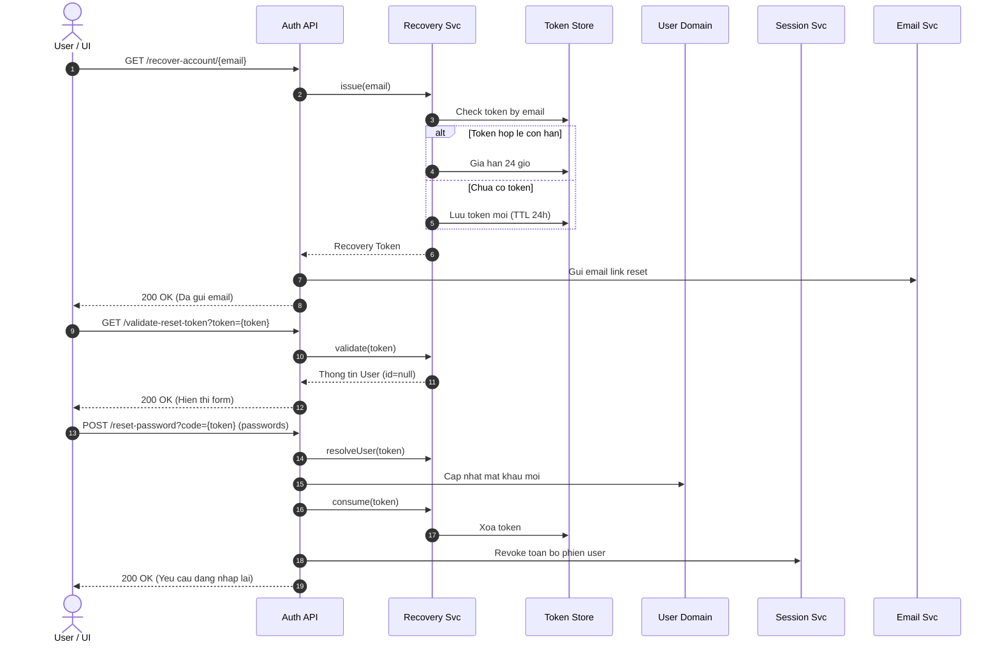
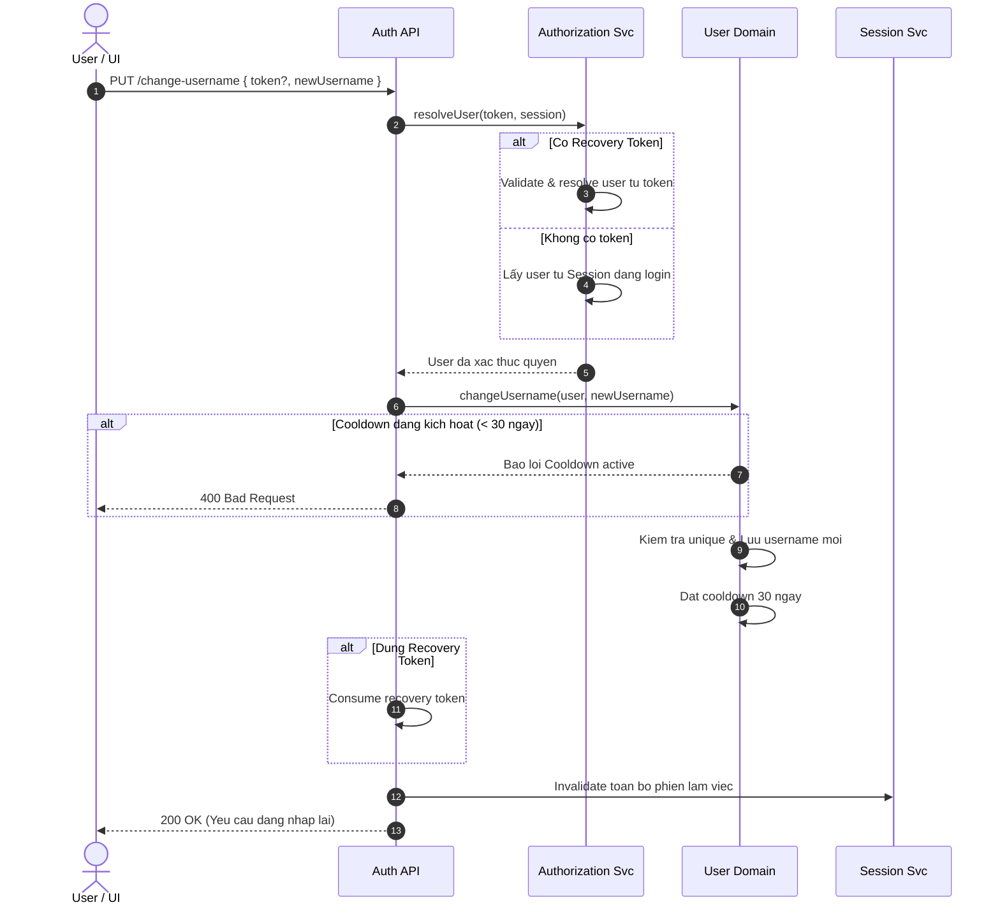

# User Identity & Account Management (IAM)

> [!NOTE]
> Module **IAM & User Management** quản lý toàn bộ vòng đời tài khoản người dùng trong hệ thống ERP: Đăng ký, kích hoạt email, xác thực đăng nhập kèm thu thập thông tin thiết bị, quản lý phiên làm việc, khôi phục tài khoản và đổi thông tin đăng nhập với các cơ chế bảo mật nghiêm ngặt (Cooldown 30 ngày, Session Revocation, Zero-Client ID reliance).

---

## 1. Khái Niệm Cốt Lõi & Mô Hình Dữ Liệu (Core Concepts & Data Models)

Tài liệu này định nghĩa các mô hình dữ liệu chính phục vụ xác thực và bảo mật người dùng.

### 1.1. Thông Tin Thiết Bị (Device Information)
Thu thập và gắn liền với phiên đăng nhập để theo dõi thiết bị, phát hiện truy cập bất thường và audit người dùng:

| Tên trường | Kiểu dữ liệu | Ràng buộc | Mô tả |
| :--- | :--- | :--- | :--- |
| `deviceType` | `String` | Tùy chọn | Loại thiết bị (`DESKTOP`, `MOBILE`, `TABLET`) |
| `deviceName` | `String` | Tùy chọn | Tên thiết bị (e.g. `MacBook Pro`, `ThinkPad T14`) |
| `osName` | `String` | Tùy chọn | Hệ điều hành (e.g. `macOS`, `Windows`, `Linux`, `Android`) |
| `osVersion` | `String` | Tùy chọn | Phiên bản hệ điều hành (e.g. `14.5`, `11`) |
| `browserName` | `String` | Tùy chọn | Tên trình duyệt (e.g. `Chrome`, `Firefox`, `Safari`) |
| `browserVersion` | `String` | Tùy chọn | Phiên bản trình duyệt (e.g. `127.0.6533.119`) |
| `screenWidth` | `Integer` | Tùy chọn | Chiều rộng màn hình (pixels) |
| `screenHeight` | `Integer` | Tùy chọn | Chiều cao màn hình (pixels) |
| `userAgent` | `String` | Tùy chọn | Chuỗi User-Agent đầy đủ từ Client |
| `ipAddress` | `String` | Tùy chọn | Địa chỉ IP của Client |
| `language` | `String` | Tùy chọn | Ngôn ngữ Client (`vi-VN`, `en-US`) |
| `timeZone` | `String` | Tùy chọn | Múi giờ (`Asia/Ho_Chi_Minh`) |
| `deviceId` | `String` | Tùy chọn | Mã định danh thiết bị duy nhất (UUID / Device Fingerprint) |

```json
{
  "deviceType": "DESKTOP",
  "deviceName": "MacBook Pro",
  "osName": "macOS",
  "osVersion": "14.5",
  "browserName": "Chrome",
  "browserVersion": "127.0.0.0",
  "screenWidth": 1920,
  "screenHeight": 1080,
  "userAgent": "Mozilla/5.0 (Macintosh; Intel Mac OS X 10_15_7)...",
  "ipAddress": "113.161.45.88",
  "language": "vi-VN",
  "timeZone": "Asia/Ho_Chi_Minh",
  "deviceId": "dev-mac-1234-uuid"
}
```

### 1.2. Mã Xác Thực & Kích Hoạt (Verification Code)
Quản lý mã token/OTP kích hoạt tài khoản hoặc xác minh qua email:

| Tên trường | Kiểu dữ liệu | Mô tả |
| :--- | :--- | :--- |
| `code` | `String` | Mã token xác thực ngẫu nhiên |
| `purpose` | `String` | Mục đích phát hành mã (`PENDING_ACTIVATION`, `ACTIVATED`, ...) |
| `expiryDate` | `DateTime` | Thời gian hết hạn của mã xác thực |

### 1.3. Dữ Liệu Kiểm Toán (Audit Information)
Theo dõi nguồn gốc tạo bản ghi, người chỉnh sửa và lịch sử cập nhật dữ liệu:

| Tên trường | Kiểu dữ liệu | Mô tả |
| :--- | :--- | :--- |
| `createdAt` | `DateTime` | Thời điểm tạo bản ghi |
| `createdBy` | `String` | Người tạo bản ghi |
| `updatedAt` | `DateTime` | Thời điểm cập nhật cuối cùng |
| `updateHistory` | `List<AuditEntry>` | Lịch sử chi tiết các lần cập nhật |
| `deletedAt` | `DateTime` | Thời điểm đánh dấu xóa mềm |
| `deletedBy` | `String` | Người thực hiện thao tác xóa |

---

## 2. Đặc Tả Chi Tiết Từng Chức Năng (API Specifications)

---

### 2.1. Đăng ký tài khoản (User Registration)
Tạo mới tài khoản người dùng ở trạng thái chờ kích hoạt và gửi email xác nhận.

* **Method & Path:** `POST /api/auth/register`
* **Xác thực:** `Public`
* **Request Payload:**
```json
{
  "name": "nguyenvanan",
  "email": "nguyenvanan@example.com",
  "password": "Password@2026",
  "confirmPassword": "Password@2026",
  "fullName": "Nguyễn Văn An"
}
```
* **Response Payload (`200 OK`):**
```json
{
  "status": {
    "code": 200,
    "message": "User registered successfully. Please verify your email."
  },
  "data": {
    "message": "User registered successfully. Please verify your email.",
    "username": "nguyenvanan",
    "email": "nguyenvanan@example.com"
  }
}
```

---

### 2.2. Xác thực kích hoạt Email (Email Verification)
Xác thực mã kích hoạt từ liên kết trong email để kích hoạt tài khoản hoạt động.

* **Method & Path:** `GET /api/auth/verify-email`
* **Xác thực:** `Public`
* **Query Parameters:**
  * `token` (String, required): Mã kích hoạt từ email (`code`).
* **Response Payload (`200 OK`):**
```json
{
  "status": {
    "code": 200,
    "message": "Email verified successfully."
  },
  "data": "Account activated"
}
```

---

### 2.3. Đăng nhập hệ thống (User Login)
Xác thực tài khoản và thu thập thông tin thiết bị để cấp phát cặp JWT Access Token & Refresh Token.

* **Method & Path:** `POST /api/auth/login`
* **Xác thực:** `Public`
* **Request Payload:**
```json
{
  "usernameOrEmail": "nguyenvanan",
  "password": "Password@2026",
  "deviceInfo": {
    "deviceType": "DESKTOP",
    "deviceName": "MacBook Pro",
    "osName": "macOS",
    "osVersion": "14.5",
    "browserName": "Chrome",
    "browserVersion": "127.0.0.0",
    "screenWidth": 1920,
    "screenHeight": 1080,
    "userAgent": "Mozilla/5.0 (Macintosh; Intel Mac OS X 10_15_7)...",
    "ipAddress": "113.161.45.88",
    "language": "vi-VN",
    "timeZone": "Asia/Ho_Chi_Minh",
    "deviceId": "dev-mac-1234-uuid"
  }
}
```
* **Response Payload (`200 OK`):**
```json
{
  "status": {
    "code": 200,
    "message": "Login successful"
  },
  "data": {
    "accessToken": "eyJhbGciOiJIUzI1NiIsInR5cCI6IkpXVCJ9...",
    "refreshToken": "7c9e6679-7425-40de-944b-e07fc1f90ae7",
    "message": "Login successful",
    "avatarUrl": "https://storage.example.com/avatars/an.png",
    "gender": "MALE",
    "username": "nguyenvanan",
    "email": "nguyenvanan@example.com",
    "phoneNumber": "0912345678"
  }
}
```

---

### 2.4. Cấp mới Access Token (Refresh Token)
Xoay vòng (rotate) và cấp mới Access Token dựa trên Refresh Token hợp lệ cùng thông tin thiết bị.

* **Method & Path:** `POST /api/auth/refresh-token`
* **Xác thực:** `Public`
* **Request Payload:**
```json
{
  "refreshToken": "7c9e6679-7425-40de-944b-e07fc1f90ae7",
  "deviceInfo": {
    "deviceType": "DESKTOP",
    "deviceName": "MacBook Pro"
  }
}
```
* **Response Payload (`200 OK`):**
```json
{
  "status": {
    "code": 200,
    "message": "Token refreshed successfully"
  },
  "data": {
    "accessToken": "eyJhbGciOiJIUzI1NiIsInR5cCI6IkpXVCJ9.new...",
    "refreshToken": "9d8b321a-5544-42b1-91ea-d5f661234567",
    "message": "Token refreshed successfully",
    "username": "nguyenvanan",
    "email": "nguyenvanan@example.com"
  }
}
```

---

### 2.5. Đăng xuất tài khoản (Logout)
Hủy phiên làm việc của người dùng hiện tại (thu hồi Access Token cache và Refresh Token tương ứng của thiết bị).

* **Method & Path:** `POST /api/auth/logout`
* **Xác thực:** `Bearer JWT`
* **Response Payload (`200 OK`):**
```json
{
  "message": "Đăng xuất thành công."
}
```

---

### 2.6. Lấy thông tin cá nhân (Get My Profile)
Lấy chi tiết hồ sơ của người dùng đang đăng nhập dựa trên token phiên.

* **Method & Path:** `GET /api/auth/me`
* **Xác thực:** `Bearer JWT`
* **Response Payload (`200 OK`):**
```json
{
  "status": {
    "code": 200,
    "message": "Success"
  },
  "data": {
    "id": "1001",
    "username": "nguyenvanan",
    "email": "nguyenvanan@example.com",
    "fullName": "Nguyễn Văn An",
    "phoneNumber": "0912345678",
    "dateOfBirth": "1998-05-15T00:00:00.000+00:00",
    "avatarUrl": "https://storage.example.com/avatars/an.png",
    "gender": "MALE",
    "rank": "MEMBER",
    "status": "ACTIVATED"
  }
}
```

---

### 2.7. Cập nhật thông tin cá nhân (Update Profile)
Cập nhật thông tin hồ sơ của người dùng đang đăng nhập.

* **Method & Path:** `PUT /api/auth/me`
* **Xác thực:** `Bearer JWT`
* **Request Payload:**
```json
{
  "fullName": "Nguyễn Văn An",
  "phoneNumber": "0987654321",
  "dateOfBirth": "1998-05-15T00:00:00.000+00:00",
  "avatarUrl": "https://storage.example.com/avatars/new_an.png",
  "gender": "MALE"
}
```
* **Response Payload (`200 OK`):** Trả về thông tin hồ sơ sau khi cập nhật.

---

### 2.8. Upload ảnh đại diện (Upload Avatar)
Tải lên file ảnh đại diện mới cho người dùng.

* **Method & Path:** `POST /api/auth/me/avatar`
* **Xác thực:** `Bearer JWT`
* **Content-Type:** `multipart/form-data`
* **Form Param:** `file` (File ảnh nhị phân)
* **Response Payload (`200 OK`):** Trả về thông tin hồ sơ kèm đường dẫn avatar mới.

---

### 2.9. Yêu cầu khôi phục tài khoản (Account Recovery)
Khởi tạo luồng khôi phục tài khoản khi người dùng quên mật khẩu hoặc thông tin đăng nhập.

* **Method & Path:** `GET /api/auth/recover-account/{email}`
* **Xác thực:** `Public`
* **Path Parameters:**
  * `email` (String, required): Email của tài khoản cần khôi phục.
* **Cơ chế Token Reuse:** Nếu email đã có recovery token còn hạn, hệ thống tái sử dụng và gia hạn thời hạn lên 24 giờ.
* **Response Payload (`200 OK`):**
```json
{
  "status": {
    "code": 200,
    "message": "Recovery instructions sent to registered email address"
  },
  "data": "n***n@example.com"
}
```

---

### 2.10. Xác thực Recovery Token (Validate Reset Token)
Kiểm tra tính hợp lệ của token trước khi hiển thị màn hình đặt mật khẩu mới.

* **Method & Path:** `GET /api/auth/validate-reset-token`
* **Xác thực:** `Public`
* **Query Parameters:**
  * `token` (String, required): Recovery Token từ email.
* **Response Payload (`200 OK`):**
```json
{
  "status": {
    "code": 200,
    "message": "Token is valid"
  },
  "data": {
    "id": null,
    "username": "nguyenvanan",
    "email": "nguyenvanan@example.com",
    "fullName": "Nguyễn Văn An",
    "numberPhone": "0912345678",
    "dateOfBirth": "1998-05-15T00:00:00.000+00:00",
    "gender": "MALE",
    "avatarUrl": "https://storage.example.com/avatars/an.png",
    "active": "ACTIVATED",
    "roles": ["MEMBER"]
  }
}
```
> [!IMPORTANT]
> `id` được chủ động ẩn (`null`) nhằm ngăn chặn Client truy xuất định danh nội bộ của người dùng.

---

### 2.11. Đặt lại mật khẩu (Reset Password)
Đổi mật khẩu mới qua Recovery Token và thu hồi ngay lập tức mọi phiên đăng nhập cũ.

* **Method & Path:** `POST /api/auth/reset-password`
* **Xác thực:** `Public` (Xác thực qua query parameter `code`)
* **Query Parameters:**
  * `code` (String, required): Recovery Token.
* **Request Payload:**
```json
{
  "token": "d748f3b2-9981-4b28-9844-486665544000",
  "newPassword": "NewStrongPassword@2026",
  "confirmPassword": "NewStrongPassword@2026"
}
```
* **Response Payload (`200 OK`):**
```json
{
  "status": {
    "code": 200,
    "message": "Password updated successfully. Please log in with your new password."
  },
  "data": null
}
```

---

### 2.12. Đổi tên đăng nhập (Change Username)
Đổi Username hỗ trợ 2 chế độ: Khi đang đăng nhập (dùng Session) hoặc Chưa đăng nhập (dùng Recovery Token).

* **Method & Path:** `PUT /api/auth/change-username`
* **Xác thực:** `Public` / `Bearer JWT`

**Chế độ 1: Đang đăng nhập (Session-based):**
```json
{
  "newUsername": "an_nguyen_2026"
}
```

**Chế độ 2: Chưa đăng nhập (Token-based):**
```json
{
  "token": "d748f3b2-9981-4b28-9844-486665544000",
  "newUsername": "an_nguyen_2026"
}
```

* **Quy tắc Cooldown 30 ngày:** Hệ thống áp dụng giới hạn 30 ngày sau mỗi lần đổi tên đăng nhập. Yêu cầu đổi tiếp trong thời gian cooldown sẽ bị từ chối.
* **Hủy phiên toàn cục:** Hủy toàn bộ Access Token và Refresh Token đang hoạt động sau khi đổi username.

---

## 3. Sơ Đồ Luồng Tuần Tự (Sequence Workflows)

### 3.1. Luồng Khôi phục tài khoản & Đặt lại mật khẩu



---

### 3.2. Luồng Đổi Username & Giới hạn Cooldown 30 ngày



---

## 4. Bảng Xử Lý Lỗi Hệ Thống (HTTP Error Matrix)

| Tình huống lỗi | Mã HTTP | Error Message | Hành vi hệ thống |
| :--- | :---: | :--- | :--- |
| Email không tồn tại khi yêu cầu recovery | `404` | `User not found` | Ngắt luồng, không gửi email |
| Tài khoản chưa kích hoạt hoặc bị khóa | `400` | `Invalid credentials` | Từ chối bảo mật chống dò quét tài khoản |
| Recovery token trống, sai hoặc hết hạn | `400` | `Invalid credentials` | Từ chối thao tác, yêu cầu lấy token mới |
| Mật khẩu mới và mật khẩu xác nhận không khớp | `400` | `Invalid credentials` | Hủy thay đổi mật khẩu |
| Username mới đã tồn tại | `400` | `Invalid credentials` | Báo lỗi trùng lặp dữ liệu |
| Đổi Username khi đang trong cooldown 30 ngày | `400` | `Invalid credentials` | Từ chối cập nhật |
| Không có Session hợp lệ và không có Recovery Token | `401` | `Unauthorized` | Chặn tại tầng phân quyền |
| Avatar upload file không đúng định dạng ảnh | `400` | `Invalid file type` | Từ chối lưu trữ |
