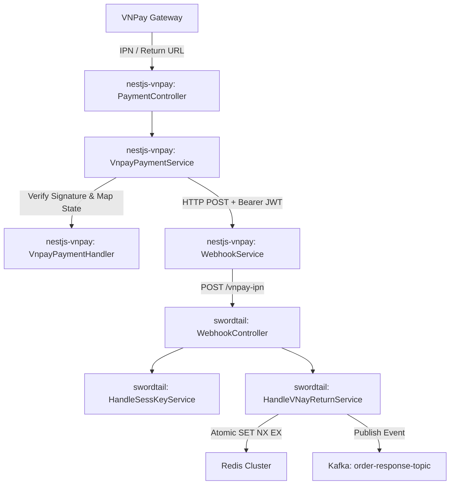
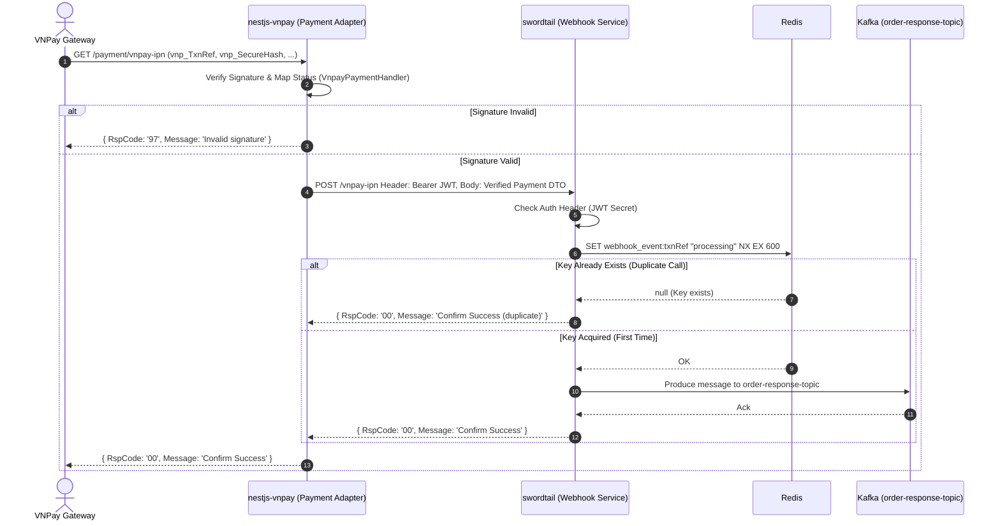
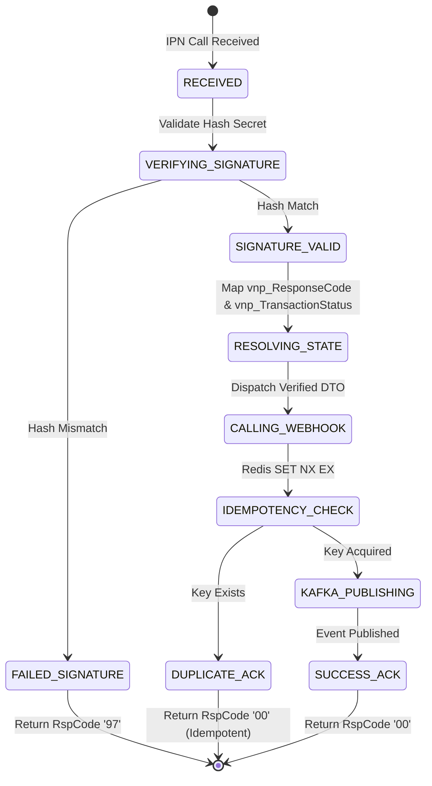

# Architecture Blueprint: VNPay Payment & Webhook Service Integration

**Feature ID:** `vnpay-webhook-integration`  
**Date:** 2026-08-04  
**Status:** Approved Architectural Blueprint  

---

## 1. Architecture Overview

### System Boundary and Affected Components
This architecture defines the integration pattern and contract between the Payment Adapter service (`nestjs-vnpay`) and the Webhook Dispatcher service (`swordtail`).

- **VNPay Gateway (External)**: Sends IPN HTTP requests and redirects users back via Return URL.
- **`nestjs-vnpay` (Payment Adapter Service)**:
  - Source Path: `/home/ddicgegd/Projects/Services-Payment/nestjs-vnpay`
  - Responsibilities: Signature validation (`vnp_SecureHash`), response code resolution, state machine management, forwarding pre-verified payment DTOs to the Webhook Service.
- **`swordtail` (Webhook Service)**:
  - Source Path: `/home/ddicgegd/orca/workspaces/webhook-service/swordtail`
  - Responsibilities: HTTP authentication (`JWT` verification), atomic idempotency locking via Redis, publishing standardized payment outcome events to Kafka.
- **Kafka Cluster (Message Broker)**: Consumes payment outcome events on `order-response-topic` for downstream processing.
- **Redis (Cache & Locking)**: Enforces distributed idempotency locks for incoming webhook calls.

### Component Dependency & Data Ownership
- **Data Ownership**:
  - `nestjs-vnpay` owns the secret key (`vnp_HashSecret`) and cryptographic verification of VNPay payloads.
  - `swordtail` owns distributed idempotency key locks (`webhook_event:<txnRef>`) and event dispatching to Kafka.
- **Dependency Direction**: `VNPay Gateway` -> `nestjs-vnpay` -> `swordtail` -> `Kafka Broker` & `Redis`.

### Architecture Diagrams

#### Component Diagram


#### Sequence Diagram (Primary Flow)


---

## 2. Significant Workflows and Contracts

### Workflow State Diagram


### Data Contracts

#### 1. Internal HTTP Webhook Request DTO (`nestjs-vnpay` -> `swordtail`)
- **Endpoint**: `POST /vnpay-ipn`
- **Headers**:
  - `Content-Type`: `application/json`
  - `Authorization`: `Bearer <JWT_TOKEN>` (Signed with `WEBHOOK_SHARED_SECRET`)
- **JSON Body Schema**:
  ```json
  {
    "txnRef": "ORDER_123456",
    "status": "SUCCESS",
    "amount": 150000,
    "currency": "VND",
    "responseCode": "00",
    "transactionNo": "14000000",
    "paidAt": "2026-08-04T16:47:23.000Z",
    "rawData": {
      "vnp_Amount": "15000000",
      "vnp_BankCode": "NCB",
      "vnp_BankTranNo": "VNP14000000",
      "vnp_CardType": "ATM",
      "vnp_OrderInfo": "Payment for Order 123456",
      "vnp_PayDate": "20260804164723",
      "vnp_ResponseCode": "00",
      "vnp_TmnCode": "TESTCODE",
      "vnp_TransactionNo": "14000000",
      "vnp_TransactionStatus": "00",
      "vnp_TxnRef": "ORDER_123456",
      "vnp_SecureHash": "..."
    }
  }
  ```

#### 2. Kafka Message Schema (`swordtail` -> `order-response-topic`)
- **Topic**: `order-response-topic`
- **Key**: `orderId` (e.g. `ORDER_123456`)
- **Value Schema**:
  ```json
  {
    "orderId": "ORDER_123456",
    "status": "SUCCESS",
    "amount": 150000,
    "responseCode": "00",
    "vnpayData": { ... }
  }
  ```

#### 3. Standard Webhook Response (`swordtail` -> `nestjs-vnpay` & `nestjs-vnpay` -> `VNPay`)
- **Success (First Execution)**: `{ "RspCode": "00", "Message": "Confirm Success" }`
- **Success (Idempotent Duplicate)**: `{ "RspCode": "00", "Message": "Confirm Success (duplicate)" }`
- **Invalid Signature**: `{ "RspCode": "97", "Message": "Invalid signature" }`
- **Internal Error**: `{ "RspCode": "99", "Message": "Internal Error" }`

---

## 3. Decisions, Risks, and Definition of Done

### Architectural Decisions

1. **Decision**: Verified Payment Event DTO pattern between `nestjs-vnpay` and `swordtail`.
   - **Reason**: Separation of concerns. `nestjs-vnpay` handles cryptographic validation and domain mapping; `swordtail` focuses on event ingestion, idempotency locking, and streaming to Kafka.
   - **Rejected Alternatives**: Forwarding raw query params and duplicating checksum verification/status mapping in `swordtail`.
   - **Consequences**: `swordtail` depends on `nestjs-vnpay`'s DTO structure; any field addition requires updated types in both TypeScript projects.

2. **Decision**: Atomic `SET key processing NX EX 600` for Idempotency in `swordtail`.
   - **Reason**: Eliminates race conditions caused by non-atomic `getEvent()` followed by delayed `set()`.
   - **Rejected Alternatives**: Separate read (`get`) then write (`set`) calls in Redis.
   - **Consequences**: Immediate single-step locking per transaction reference (`vnp_TxnRef`).

3. **Decision**: Return `RspCode: '00'` on Idempotent Duplicate Calls.
   - **Reason**: VNPay IPN guidelines specify returning success acknowledgment once an order is confirmed, avoiding endless retries by VNPay.
   - **Rejected Alternatives**: Returning `RspCode: '02'`, which caused `nestjs-vnpay` to log errors.

### Confirmed Assumptions & Accepted Risks
- **Confirmed Assumptions**:
  - Redis instance is shared or accessible by `swordtail`.
  - Kafka brokers are reachable by `swordtail` with producer permissions for `order-response-topic`.
- **Accepted Risks**:
  - Network partition between `nestjs-vnpay` and `swordtail` will cause `nestjs-vnpay` to return `RspCode: '99'` to VNPay, triggering VNPay IPN retry mechanism (which is standard behavior).

### Explicit Exclusions
- Modifications to VNPay gateway API endpoints or checksum calculation algorithms.
- Changes to database schemas in consumer services downstream of Kafka.

### Definition of Done (DoD)
1. `nestjs-vnpay` updates `WebhookService` to post verified `PaymentResultEvent` DTOs.
2. `swordtail` updates `handleVNayReturnService` to use atomic Redis `SET NX EX` and return `RspCode: '00'` for both new and duplicate IPNs.
3. `swordtail` JWT verification logic (`handleSessKeyService`) updated to validate `WEBHOOK_SHARED_SECRET`.
4. Unit/integration tests added in both projects to verify signature validation, idempotency, and Kafka payload generation.

---

## 4. Control Harness

### 1. Outcome
- **Business Target**: Zero loss of payment notifications, zero duplicate processing in Kafka, accurate payment status mapping for all VNPay transactions.
- **Technical Target**: End-to-end integration between `nestjs-vnpay` and `swordtail` passing IPN verification, Redis idempotency locking, and Kafka publishing cleanly.

### 2. Verifiable End State
- Verified DTO successfully sent from `nestjs-vnpay` to `swordtail`.
- Duplicate IPN requests return `RspCode: '00'` without producing duplicate Kafka messages.
- Clean execution of tests in both services without unhandled promise rejections or auth errors.

### 3. Relevant Context
- Payment Adapter: `/home/ddicgegd/Projects/Services-Payment/nestjs-vnpay`
- Webhook Service: `/home/ddicgegd/orca/workspaces/webhook-service/swordtail`
- Blueprint Path: `/home/ddicgegd/Projects/erp_springboot-experiment/docs/features/vnpay-webhook-integration/architecture.md`

### 4. Constraints
- Must preserve existing NestJS controller routes (`/payment/vnpay-return`, `/payment/vnpay-ipn`).
- Must maintain Express routing in `swordtail` (`/vnpay-ipn`).
- Must adhere to VNPay IPN specification for response codes.

### 5. Validation Loop
1. Run `npm test` or build check in `nestjs-vnpay`.
2. Run `npm test` or build check in `swordtail`.
3. Verify JWT token signature validation between services using identical secret.

### 6. Workspace and Logging
- Logging level: Verbose logging of `vnp_TxnRef` across both services for full traceability.

### 7. Stop Rules
- Stop execution if VNPay hash calculation formula changes.
- Stop execution if Redis or Kafka configurations are unreachable during integration testing.
