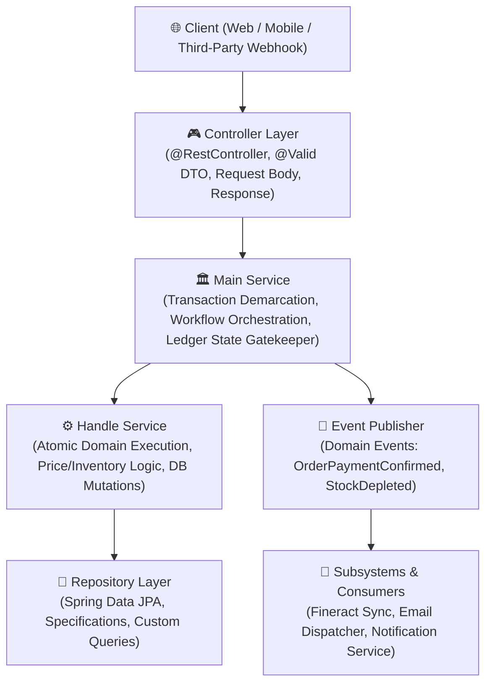

# 00 - SYSTEM ARCHITECTURE AND CONVENTIONS

## 1. Technical Stack Overview
- **Runtime Environment:** Java 17+, Spring Boot 3.x
- **Persistence & Data Layer:** Spring Data JPA, Hibernate, PostgreSQL/MySQL
- **Object Mapping & Boilerplate:** MapStruct, Project Lombok
- **Infrastructure & Storage:** Docker Compose, MinIO / AWS S3 (Object Storage for Images & Avatars), Redis (Session Cache, Pin Tokens, Category Trees)
- **External Financial & Payment Integrations:** 
  - VNPay Payment Gateway (IPN / Webhook, SHA512 Checksum, Idempotency)
  - Apache Fineract (Core Banking, General Ledger Journal Entries, Loan Portfolio Management)

---

## 2. Layered Architecture & Service Decomposition Protocol



### Protocol Guidelines:
1. **Controller Layer:**
   - Exclusively responsible for HTTP request decoding, header processing, `@Valid` bean validation, and returning standard `Response<T>`.
   - Never contains business logic, calculations, or direct JPA repository mutations.
2. **Main Service (Reviewer & Orchestrator):**
   - Holds `@Transactional` boundaries.
   - Acts as the gatekeeper for task states and high-level workflow orchestration.
   - Enforces ledger-based transitions (e.g., `order.md` or domain state machines).
3. **Handle Service (Execution Engine):**
   - Focuses strictly on atomic domain rules, calculation logic, and entity state transitions.
   - Returns domain models or DTOs directly without HTTP semantics.
4. **Repository Layer:**
   - Spring Data JPA repositories with query methods and JPA Specifications for complex dynamic queries.

---

## 3. Global Response Envelope & Pagination Standards

### Standard Single Object Envelope (`Response<T>`):
```json
{
  "code": 1000,
  "message": "Operation completed successfully",
  "data": { ... }
}
```

### Standard Pagination Envelope (`PagingResponse<T>`):
```json
{
  "pageNumber": 0,
  "pageSize": 20,
  "totalPages": 5,
  "totalElements": 95,
  "isFirst": true,
  "isLast": false,
  "data": [
    { ... },
    { ... }
  ]
}
```

---

## 4. Error Handling Protocol & Error Dictionary

### Global Exception Handler (`@RestControllerAdvice`):
- Catches `AppException` (custom domain exceptions with `ErrorCode`).
- Catches `MethodArgumentNotValidException` for bean validation errors (`@NotNull`, `@Size`, `@Pattern`).
- Catches `AccessDeniedException` (403 Forbidden) and `AuthenticationException` (401 Unauthorized).

### Common Error Code Reference:
| Error Code | HTTP Status | Meaning / Trigger Scenario | Resolution |
| :--- | :--- | :--- | :--- |
| `1000` | 200 OK | Success | Normal operation |
| `1001` | 400 Bad Request | Invalid Request Payload / Bean Validation Failure | Check payload fields against schema constraints |
| `1002` | 401 Unauthorized | Unauthenticated / Invalid or Expired Token | Login or refresh authentication token |
| `1003` | 403 Forbidden | Access Denied / Insufficient Role Permissions | Ensure user has required role/scope |
| `1004` | 404 Not Found | Resource Not Found (User, Product, Order ID) | Verify identifier in query or path parameter |
| `1005` | 409 Conflict | Duplicate Unique Field (Email, Username, SKU) | Use unique identifier |
| `1006` | 400 Bad Request | Insufficient Inventory Stock | Update cart quantity or check stock level |
| `9999` | 500 Internal Error | Uncaught System / Infrastructure Exception | Inspect application server error logs |
