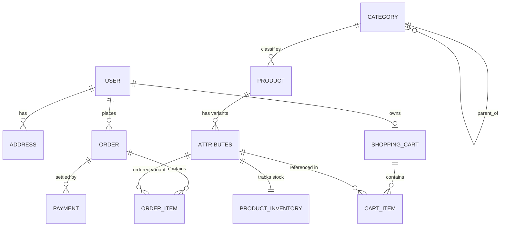

# 01 - DOMAIN MODEL AND DATABASE SCHEMA

## 1. Ubiquitous Language & Core Terminology

| Term | Domain Concept | Technical Entity / Class |
| :--- | :--- | :--- |
| **User** | Người dùng hệ thống (Admin, Staff, Customer), định danh và quyền. | `com.ddicg.erp.modules.iam.model.User` |
| **Address** | Địa chỉ giao hàng / thanh toán liên kết với User. | `com.ddicg.erp.modules.iam.model.Address` |
| **Category** | Danh mục phân cấp sản phẩm theo cấu trúc cây (Parent - Child). | `com.ddicg.erp.modules.merchandise.model.Category` |
| **Product** | Mặt hàng chính (thông tin tổng quan, mô tả, ảnh, thương hiệu). | `com.ddicg.erp.modules.merchandise.model.Product` |
| **Attributes** | Biến thể sản phẩm (SKU Item) lưu kho bán thực tế (Color, Size, SKU Code). | `com.ddicg.erp.modules.merchandise.model.Attributes` |
| **Product Inventory** | Bản ghi quản lý số lượng tồn kho theo từng biến thể SKU. | `com.ddicg.erp.modules.merchandise.model.ProductInventory` |
| **ShoppingCart** | Giỏ hàng tạm thời của khách hàng. | `com.ddicg.erp.modules.cart.model.ShoppingCart` |
| **CartItem** | Chi tiết từng sản phẩm/biến thể trong giỏ hàng. | `com.ddicg.erp.modules.cart.model.CartItem` |
| **Order** | Đơn đặt hàng chính thức sau khi checkout. | `com.ddicg.erp.modules.order.model.Order` |
| **OrderItem** | Dòng sản phẩm trong đơn hàng kèm snapshot giá tại thời điểm mua. | `com.ddicg.erp.modules.order.model.OrderItem` |
| **Payment** | Giao dịch thanh toán (VNPay, Tiền mặt, Banking) gắn với Order. | `com.ddicg.erp.modules.order.model.Payment` |

---

## 2. Entity Relationship Diagram (Mermaid ERD)

---

## 3. Core Status Enums & State Constants

### User Status:
- `ACTIVE`: Tài khoản hoạt động bình thường.
- `INACTIVE`: Tài khoản chưa xác thực email.
- `BLOCKED`: Tài khoản bị khóa do vi phạm bảo mật hoặc hành vi bất thường.

### Order Status Flow:
- `PENDING`: Đơn hàng vừa tạo, chờ thanh toán hoặc xác nhận.
- `PROCESSING`: Đơn hàng đang được đóng gói / xử lý kho.
- `SHIPPED`: Đơn hàng đã giao cho đơn vị vận chuyển.
- `DELIVERED`: Đơn hàng đã giao thành công cho khách hàng.
- `CANCELLED`: Đơn hàng đã bị hủy trước khi giao.
- `REFUNDED`: Đơn hàng đã hoàn tiền.

### Payment Status:
- `PENDING`: Đang chờ thanh toán cổng ngoại vi.
- `SUCCESS`: Thanh toán thành công (xác nhận bởi VNPay IPN/Webhook).
- `FAILED`: Giao dịch thanh toán thất bại.
- `REFUNDED`: Giao dịch đã hoàn tiền lại cho khách hàng.
