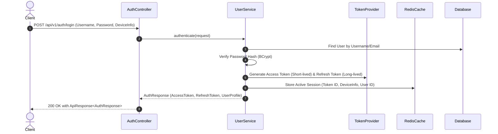

# 02 - MODULE IAM AND SECURITY

## 1. Module Overview & Scope
Phân hệ Identity & Access Management (IAM) quản lý toàn bộ vòng đời tài khoản người dùng, cơ chế xác thực JWT, phân quyền truy cập Role-Based Access Control (RBAC), và thu hồi phiên làm việc bảo mật.

---

## 2. Authentication & Token Architecture

### Key Workflows:
1. **User Registration & Activation:**
   - Người dùng đăng ký tài khoản với trạng thái ban đầu `INACTIVE`.
   - Sinh Verification Token 6 chữ số / UUID gửi qua Email.
   - Khi kích hoạt thành công $\rightarrow$ Chuyển trạng thái sang `ACTIVE`.
2. **Refresh Token Rotation & Security:**
   - Khi Access Token hết hạn, Client gửi Refresh Token kèm `DeviceInfo`.
   - Hệ thống kiểm tra phiên trong Redis/Database, thu hồi token cũ và phát hành cặp token mới.
   - Nếu phát hiện token bị tái sử dụng bất hợp pháp (Token Reuse Detection) $\rightarrow$ Thu hồi toàn bộ phiên của người dùng.
3. **Password Recovery & Cooldown Rules:**
   - Quên mật khẩu: Sinh Reset Token có hiệu lực 24 giờ.
   - Đổi Username: Áp dụng Cooldown 30 ngày giữa 2 lần đổi và tự động thu hồi mọi phiên đăng nhập trên các thiết bị khác.
   - Avatar Upload: Hỗ trợ multipart upload lưu trữ trực tiếp trên MinIO/S3 với định dạng ảnh hợp lệ (JPEG, PNG, WebP).
