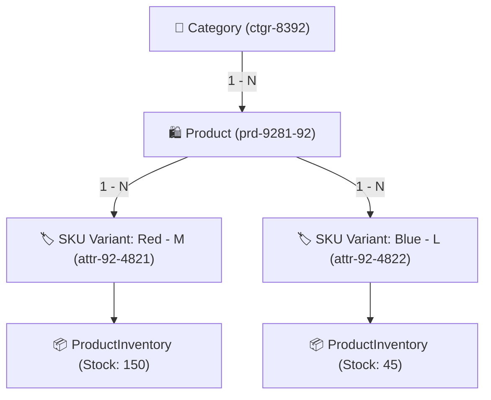

# 03 - MODULE CATALOG AND MERCHANDISE

## 1. 3-Tier Merchandise Hierarchy
Phân hệ Hàng hóa (Merchandise) tổ chức theo mô hình phân tầng chặt chẽ 3 cấp:
1. **Category (Danh mục):** Cấu trúc cây đa cấp (Parent - Child). Hỗ trợ cache `categoryDetails` và cơ chế xóa mềm (soft delete) lưu trữ 30 ngày trước khi xóa vĩnh viễn.
2. **Product (Mặt hàng tổng quan):** Chứa thông tin gốc, tên, thương hiệu, mô tả SEO, danh sách hình ảnh trên MinIO/S3, các chỉ số đo lường hiệu năng bán hàng (`viewCount`, `soldCount`, `revenue`).
3. **Attributes / SKU Item (Biến thể lưu kho bán):** Đơn vị thực thể bán hàng thực tế chứa Mã SKU duy nhất, màu sắc, kích cỡ, tồn kho (`ProductInventory`) và cấu trúc 3 tầng giá (Giá nhập, Giá niêm yết, Giá bán khuyến mãi).

---

## 2. Dynamic Attribute & Smart Search Engine
- **Quản lý Thuộc tính Động (Attributes):**
  - Khả năng tạo thuộc tính linh hoạt theo ngành hàng (vd: Thời trang có Size/Color, Thiết bị điện tử có RAM/Storage/Color).
  - Tự động sinh mã SKU chuẩn format theo quy tắc `[Category_Code]-[Product_Code]-[Variant_Code]`.
- **Smart Search & Filtering:**
  - Tìm kiếm toàn văn (Full-text search) theo tên sản phẩm, mã SKU, khoảng giá, trạng thái tồn kho (`inStock = true/false`).
  - Hỗ trợ phân trang chuẩn `Pageable` và sắp xếp đa tiêu chí (mới nhất, bán chạy nhất, giá tăng/giảm dần).

---

## 3. Inventory & Pricing Rules
- **Kho hàng (Inventory):**
  - Mọi thao tác trừ tồn kho phải sử dụng khóa lạc quan (Optimistic Locking) hoặc cơ chế kiểm tra `stock >= quantity` trong câu update để tránh bán âm kho (overselling).
  - Cảnh báo ngưỡng tồn kho an toàn (Low Stock Alert Threshold).
- **3 Tầng Giá (Pricing Structure):**
  - `Import Price` (Giá nhập): Dùng tính toán lợi nhuận, bảo mật với khách hàng thông thường.
  - `List Price` (Giá niêm yết gốc): Giá gạch ngang hiển thị trên UI.
  - `Sale Price` (Giá bán thực tế): Giá khách hàng thanh toán tại thời điểm đặt hàng.
