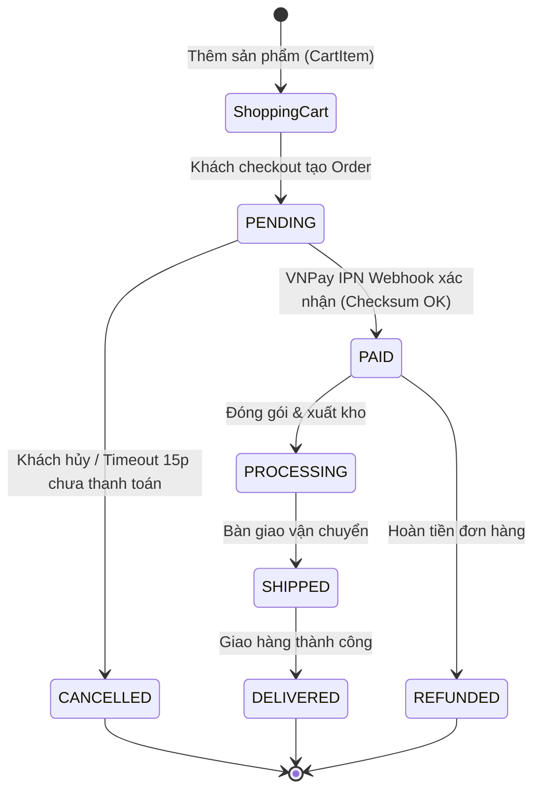

# 04 - MODULE ORDER CART AND PAYMENTS

## 1. Order & Cart Lifecycle
Mô tả toàn bộ chu trình mua hàng từ khi thêm sản phẩm vào giỏ hàng (`ShoppingCart`), xác nhận thanh toán (`Order`), nhận Webhook qua cổng thanh toán VNPay và hạch toán kế toán sang Apache Fineract.

---

## 2. VNPay Webhook / IPN Integration Specification

### 1. Checksum & Security Validation:
- Nhận query parameters từ VNPay Callback/IPN URL.
- Tạo chuỗi hash dữ liệu `vnp_SecureHash` theo chuẩn SHA512 hoặc HMAC-SHA512 với Secret Key cấu hình trong hệ thống.
- Nếu Checksum không khớp $\rightarrow$ Trả về mã lỗi VNPay `RspCode = 97` (Invalid Signature), không thực hiện thay đổi dữ liệu.

### 2. Idempotency Handling (Chống trùng lặp Webhook):
- VNPay có thể retry gọi webhook nhiều lần cho cùng 1 giao dịch.
- Hệ thống kiểm tra trạng thái đơn hàng hiện tại trước khi xử lý:
  - Nếu `Order.status` đã ở trạng thái `PAID` hoặc `PROCESSING` $\rightarrow$ Trả về ngay `RspCode = 02` (Order already confirmed), không ghi đè dữ liệu lần 2.

### 3. Amount Verification:
- So sánh `vnp_Amount` nhận được (lưu ý VNPay nhân 100 số tiền thực tế) với `Order.totalAmount`.
- Nếu phát hiện sai lệch số tiền $\rightarrow$ Ghi log báo động bảo mật, trả về `RspCode = 04` (Invalid Amount).

### 4. VNPay Response Codes Standard:
- `00`: Confirm Success (Giao dịch thành công).
- `01`: Order not Found (Không tìm thấy đơn hàng trong hệ thống).
- `02`: Order already confirmed (Đơn hàng đã được cập nhật trước đó - Idempotent).
- `04`: Invalid Amount (Số tiền không hợp lệ).
- `97`: Invalid Checksum (Chữ ký không hợp lệ).

---

## 3. Financial Integration (Apache Fineract)
- Khi đơn hàng chuyển sang `PAID` $\rightarrow$ Phát sinh sự kiện Domain Event `OrderPaymentConfirmedEvent`.
- Subsystem Fineract lắng nghe sự kiện để tạo bút toán ghi nhận doanh thu và dòng tiền vào tài khoản kế toán doanh nghiệp (General Ledger Journal Entries).
